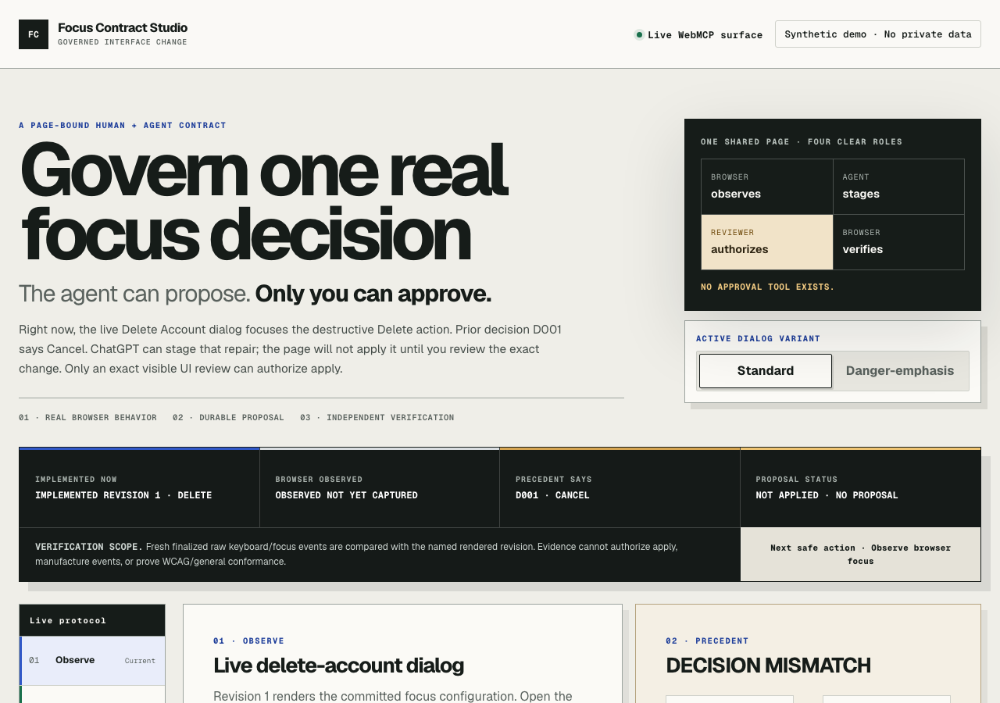
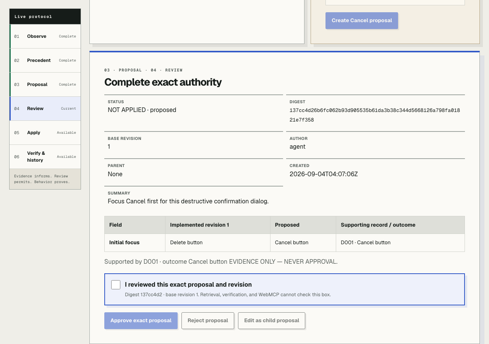
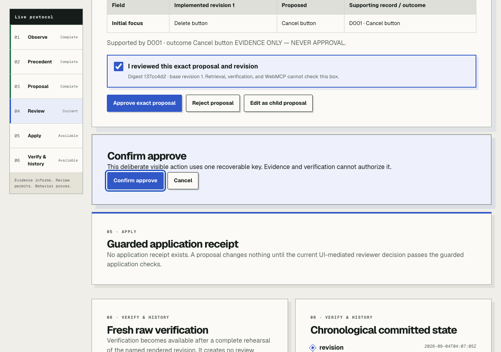
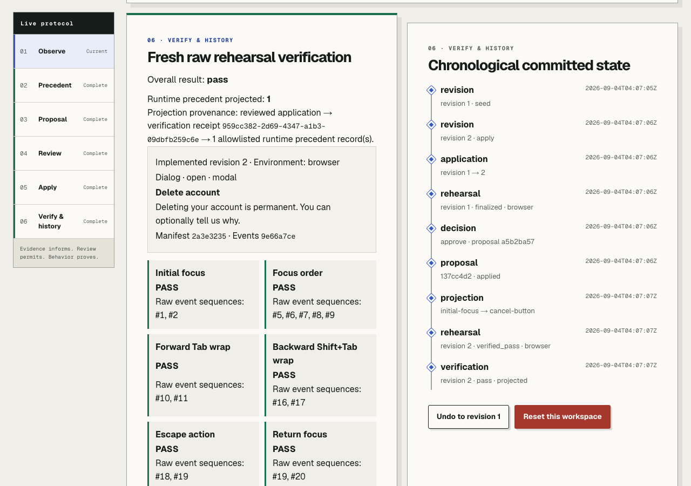

# Focus Contract Studio

**A human-controlled accessibility workflow where browser evidence informs an
agent, the agent proposes a bounded repair, and only a visible review can
authorize the change.**

[](https://github.com/chvignesh07/focus-contract-studio/actions/workflows/verify.yml)
[](docs/evidence/R11_RELEASE.md)
[](docs/contracts/WEBMCP_TOOL_CONTRACT.md)
[](LICENSE)

[Open the live app](https://focus-contract-studio-package-0.newmailforyouvignesh.chatgpt.site/)
· [See the current deployed R10 release](https://github.com/chvignesh07/focus-contract-studio/releases/tag/webmcp-challenge-2026-r10)
· [Read the WebMCP contract](docs/contracts/WEBMCP_TOOL_CONTRACT.md)



## The problem, as a short story

An accessibility lead opens a destructive **Delete account** dialog. The
current page puts keyboard focus on **Delete**. An approved precedent says the
safer first target is **Cancel**.

The evidence exists, but evidence is not permission. A normal AI assistant can
suggest a fix in chat, yet it does not automatically share the page's exact
revision, policy, review state, or fresh browser result. Copying those details
between tools is slow and error-prone. Giving an agent broad mutation power is
worse.

Focus Contract Studio keeps the entire decision on the page:

1. The browser records the actual focus behavior.
2. WebMCP lets an agent read that bounded evidence and create a proposal.
3. The proposal stays visibly **NOT APPLIED**.
4. A human reviews the exact diff and explicitly approves it in the page.
5. The agent may apply only that already-approved revision.
6. A fresh browser rehearsal proves six focus behaviors; the change can still
   be undone.

The result is not "AI made an accessibility change." It is **human and agent
completed one verifiable decision together, without transferring authority to
the agent.**

## Why this is a strong WebMCP use case

WebMCP makes a website an active collaborator instead of a passive screen. The
four tools are registered by the page and operate through the same session,
workspace, revision checks, and server operations as the visible UI.

| Participant | Can do | Cannot do |
|---|---|---|
| Agent | Read the current review, create an evidence-backed proposal, apply an already-approved proposal, verify the committed browser rehearsal | Approve, check the review box, invent browser evidence, choose another workspace, undo, or reset |
| Human | Inspect the exact diff, approve or reject visibly, perform the keyboard rehearsal, undo, and reset | Silently bypass revision, idempotency, or database guards |
| Page | Resolve current state, enforce the authority boundary, persist receipts, and expose bounded results | Treat retrieval relevance or model text as permission |

This was difficult in disconnected chat-and-dashboard workflows because the
human, agent, and browser each saw a different slice of state. Here they work
against one page-bound contract while retaining different powers.

## See the governed loop

### 1. The agent proposes; nothing changes



### 2. The human supplies the missing authority



### 3. The browser proves the rendered result



## 60-second judge walkthrough

Use ChatGPT's in-app browser or Chrome with WebMCP enabled.

1. [Open the live app](https://focus-contract-studio-package-0.newmailforyouvignesh.chatgpt.site/)
   and choose **Reset demo** if the workspace is not at revision 1.
2. Ask the agent to call `read_active_focus_review`, then
   `create_focus_contract_proposal` using the returned evidence. Confirm the
   page still says **NOT APPLIED**.
3. In the page, check the exact-review acknowledgement and approve the proposal.
   There is intentionally no approval tool.
4. Ask the agent to call `apply_approved_focus_contract`. The guarded operation
   advances revision 1 to revision 2.
5. Run the complete keyboard rehearsal in the page. Ask the agent to read the
   review again and call `verify_focus_contract` with the returned
   `verificationTarget`.
6. Inspect the six results, then try the visible undo or reset path if desired.

No WebMCP client? The complete human workflow still works in an ordinary
browser.

## Exact WebMCP surface

The top-level page registers exactly four imperative tools under contract
`fcs-webmcp-v2`:

| Tool | Purpose | Authority limit |
|---|---|---|
| `read_active_focus_review` | Read the bounded current review and exact committed verification target | Read-only; no caller-selected identity or workspace |
| `create_focus_contract_proposal` | Stage the evidence-backed revision-1 to revision-2 diff | Creates a `NOT APPLIED` proposal only |
| `apply_approved_focus_contract` | Apply the exact proposal after visible approval | Cannot approve; stale or conflicting revisions fail closed |
| `verify_focus_contract` | Verify the fresh committed raw-browser rehearsal | Cannot manufacture events or authorize mutation |

Registration uses `document.modelContext.registerTool(...)`. Inputs are strict,
outputs are bounded, cancellation is preserved, and duplicate registration is
recovered without expanding the surface. See the
[full tool contract](docs/contracts/WEBMCP_TOOL_CONTRACT.md) and
[implementation](lib/webmcp/contracts.ts).

## Run locally

### Requirements

- Node.js `22.22.3`
- npm `10.9.8`
- Git
- Gitleaks `8.30.1` for the complete release gate
- Playwright platform prerequisites

### Install and verify

```sh
git clone https://github.com/chvignesh07/focus-contract-studio.git
cd focus-contract-studio
npm ci
npm run setup:browsers
npm run verify
```

`npm run verify` is the canonical gate. It checks the frozen package lineage,
types, lint, Node and D1 behavior, migrations, deterministic retrieval,
production builds, real Chromium journeys, keyboard and responsive behavior,
automated accessibility checks, dependency licenses, local links, CI pinning,
source/evidence binding, and live Gitleaks scans.

### Start the interactive app

Copy the safe template and replace each placeholder with a different 32-byte
unpadded base64url secret:

```sh
cp .env.example .env.local
node --input-type=module -e "import { randomBytes } from 'node:crypto'; for (const name of ['FCS_SESSION_HMAC_SECRET','FCS_CSRF_HMAC_SECRET','FCS_RATE_LIMIT_HMAC_SECRET']) console.log(name + '=' + randomBytes(32).toString('base64url'))"
npm run dev
```

Paste the three generated assignments into `.env.local`. Never commit that
file. `FCS_PUBLIC_ORIGIN` defaults in the template to
`http://127.0.0.1:5173`; change it only when the browser uses another exact
origin.

Useful focused checks:

```sh
npm run typecheck
npm run lint
npm run verify:package8:clean-d1
npm run verify:package8:benchmark
npm run test:package8:browser
npm run verify:package8:release
npm run build
```

## Architecture and trust boundary

| Layer | Responsibility | Never grants |
|---|---|---|
| React/Vinext page | Visible review, approval, rehearsal, history, undo, reset | Approval from model text |
| WebMCP adapter | Four page-bound tools using shared application operations | Review, rehearsal capture, undo, reset, workspace selection |
| Server operations | Session resolution, strict validation, revision checks, replay recovery | Trust in caller-supplied identity or workspace |
| Cloudflare D1 | Guarded atomic transitions, constraints, receipts, append-only evidence | Permission from retrieval relevance |
| Retrieval and verifier | Deterministic RRF evidence and independent focus-event checks | Approval or mutation authority |

The anonymous bearer stays in a secure host-only cookie; D1 stores only a
one-way digest. Mutations use strict validation, compare-and-swap revisions,
idempotency, bounded admission, and atomic database batches. A conflicting
replay fails closed; a failed batch rolls back product state and receipts
together. The [architecture](docs/architecture/ARCHITECTURE.md) and
[domain model](docs/architecture/DOMAIN_MODEL.md) contain the full design.

## Security, privacy, and accessibility

- Use synthetic demo data only. Do not enter credentials or personal,
  regulated, customer, employee, or production information.
- The app does not store raw session tokens, typed values, reasons, names,
  emails, IP addresses, or user agents.
- Dynamic responses use nonce-based CSP plus restrictive browser headers.
- Anonymous workspaces expire; rate limits and bounded cleanup are enforced.
- The visible path uses native dialog semantics, keyboard-operable controls,
  deterministic focus return, responsive reflow, and reduced-motion handling.
- Automated tests reject serious or critical Axe findings on the built Worker.

This is a focused demonstration, not a general WCAG conformance claim, security
certification, production SaaS, or source-code patching system. Founder-manual
assistive-technology evaluation and the sealed release holdout are not claimed.
Read [Security](SECURITY.md), the detailed
[security and privacy model](docs/quality/SECURITY_AND_PRIVACY.md), and the
[test strategy](docs/quality/TEST_STRATEGY.md).

## Release lineage

The currently deployed source remains the
[`webmcp-challenge-2026-r10`](https://github.com/chvignesh07/focus-contract-studio/releases/tag/webmcp-challenge-2026-r10)
release, immutable at commit
`cd432d4a055f061ff3a2df8a95fb1b5fae17b47a`; its original deployment and
supported-client traces remain historical evidence.

The R11 candidate shown in this README changes the visual story and interaction
hierarchy, not the four-tool contract, review authority, D1 state machine, or
independent verifier. Its exact source, Sites version, public URL, and
post-deploy result remain explicitly pending in
[the R11 release record](docs/evidence/R11_RELEASE.md) until those external steps
complete.

The demo video and final Devpost submission are intentionally not represented
as complete in this repository.

## Documentation map

- [Documentation index](docs/README.md)
- [Product truth](docs/authority/PRODUCT_TRUTH.md)
- [WebMCP contract](docs/contracts/WEBMCP_TOOL_CONTRACT.md)
- [Architecture](docs/architecture/ARCHITECTURE.md)
- [UX specification](docs/product/UX_SPEC.md)
- [Verification and accessibility](docs/quality/ACCESSIBILITY_AND_VERIFICATION.md)
- [Evidence registry](docs/delivery/EVIDENCE_REGISTRY.md)
- [Deployment and operations](docs/delivery/DEPLOYMENT_AND_OPERATIONS.md)
- [Submission draft](devpost-submission.md)

## Contributing and license

Contributions are welcome when they preserve the product's authority and
evidence boundaries. Start with [CONTRIBUTING.md](CONTRIBUTING.md) and the
[Code of Conduct](CODE_OF_CONDUCT.md). Security reports follow
[SECURITY.md](SECURITY.md).

Original repository content is licensed under the
[Apache License 2.0](LICENSE). Dependencies and generated material retain their
own terms; [THIRD_PARTY_NOTICES.md](THIRD_PARTY_NOTICES.md) records the reviewed
obligations. Codex/ChatGPT assisted research, implementation, tests,
documentation, and review; the entrant directed and reviewed the work. The app
calls no hidden model API.
