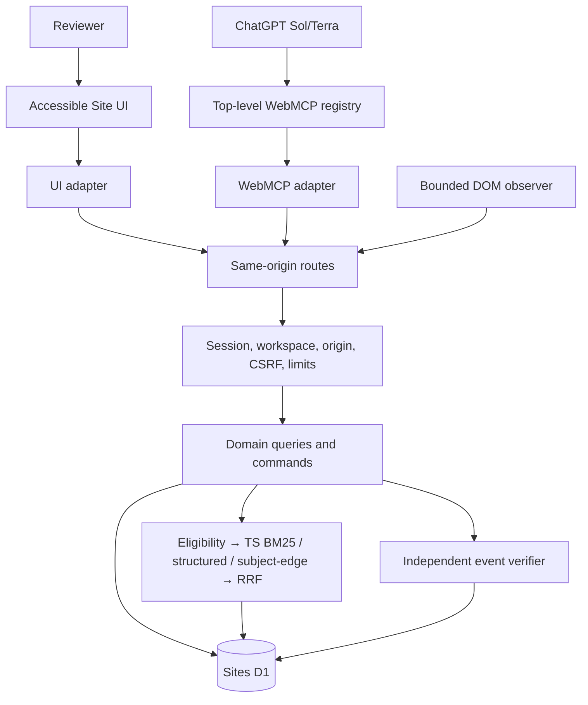

# Focus Contract Studio — Architecture

Status: **IMPLEMENTATION CONTRACT v2**

## Thesis

One full-stack ChatGPT Site owns presentation, imperative WebMCP registration, same-origin routes, deterministic domain services, Sites D1, bounded retrieval, and raw-event verification. The active revision is implemented configuration. Retrieval can make an agent-authored change admissible; only a separate UI-mediated exact review can authorize apply.

## System context



## Trust boundaries

| Boundary | Trusted | Never trusted |
|---|---|---|
| Browser/UI | Displaying server DTOs; capturing allowlisted DOM facts. | Ownership, approval, current revision, canonical hash, eligibility, or verification result. |
| ChatGPT/WebMCP | Supplying strict operation arguments. | Identity, review authority, retrieved text as instruction, or annotations as enforcement. |
| Same-origin server | Resolving session/workspace; validation; guards; canonicalization; verifier execution. | Client-selected authoritative state or cached bootstrap state. |
| D1 | Constraints and committed records. | Intent; all authorization remains in guarded predicates. |
| UI-mediated review | Recording an explicit browser-session decision for the exact displayed proposal. | Biological-human attestation or permission to bypass deterministic checks. |

## Layer rules

1. **Presentation:** semantic controls, native dialog, text-only rendering of untrusted rationale, stable state labels, no repository imports.
2. **Adapters:** UI and WebMCP call the same domain operations. WebMCP has no approval/reject/revoke/reset/undo capability.
3. **Server:** workspace comes only from server session; strict Zod/body/content-type/rate/origin/CSRF checks; stable public errors; private correlation IDs.
4. **Domain:** pure reducers/canonicalization/verifier; command handlers treat preliminary reads as diagnostics only and authorize inside guarded database writes.
5. **Persistence:** numbered additive SQL migrations, `STRICT` tables when compatible, prepared statements, append-only revisions/decisions/receipts/audit while a workspace is retained.
6. **Retrieval:** indexed eligibility query first; all rankers consume the same at-most-36 eligible rows; retrieval never enters review/apply authorization predicates.
7. **Verification:** finalized raw events plus an independently captured rendered manifest and the named implemented revision; no retrieval/model dependency.

## Core flows

### Render and observe

1. Server resolves workspace and `workspace_view_state.active_variant_id`.
2. Server returns the active implemented revision and an allowlisted render model.
3. Renderer deterministically uses that revision; no hidden implementation toggle exists.
4. Observer starts a session bound to workspace, variant, revision, and generated nonce.
5. Observer captures a bounded actual-DOM manifest—present stable target IDs, actual tabbable DOM order, dialog role/modal attributes—and bounded focus/key events. No values/text are captured.
6. Server validates and freezes manifest/events; the verifier later consumes only these frozen facts and the named revision.

### Read and retrieve

After visible page bootstrap establishes the session/workspace, the server constructs a neutral context from current variant and observed outcome. It does not include the target/expected outcome. It captures one whole-second server time, uses it as retrieval `asOf`, loads eligible precedent, runs the three fixed rankers and RRF, and returns at most three evidence records plus a short session/workspace/state/result-bound HMAC token marked “Evidence only — not approval.” The tool read never bootstraps, refreshes, cleans up, audits, or otherwise writes product state.

### Create proposal

```mermaid
sequenceDiagram
    participant A as Reviewer UI or ChatGPT adapter
    participant S as Server
    participant D as Proposal service
    participant DB as D1
    A->>S: baseRevision + target configuration + evidence token + citations + key
    S->>S: resolve workspace/session; strict parse
    D->>D: canonicalize; compute hash and changed fields
    D->>D: rerun token-time retrieval; verify token/results/field support
    D->>DB: guarded batch persists evidence snapshot + immutable proposal
    DB-->>D: proposal receipt or zero-row/error
    D-->>A: immutable NOT_APPLIED proposal
```

For agent-authored changes, every changed field must map to a cited eligible normalized precedent outcome from the verified token-bound packet. An abstention may support an unchanged/no-op proposal only; it cannot support a novel agent change. The reviewer UI may create a novel changed proposal after an explicit “No applicable precedent” warning, but that does not bypass later review/apply.

### UI-mediated review

- There is no WebMCP/API review operation.
- The visible page displays complete canonical diff, base revision, citations, untrusted rationale, and proposal digest fragment.
- An explicit confirmation records approve/reject/revoke as an append-only decision bound to proposal ID/hash/base revision/current browser session.
- Editing creates a child proposal; it never mutates the reviewed payload.

### Guarded apply — exact D1 design

Preliminary reads improve error messages only. Authorization happens inside one D1 `batch()` with pre-generated opaque IDs:

1. `INSERT ... SELECT` one `application_guards` row only when authoritative joins prove workspace, active variant, approved latest decision, proposal hash, base/current/expected revision, unapplied state, and new/same idempotency request hash.
2. Insert the next implemented revision with `SELECT ... FROM application_guards WHERE guard_id=?`.
3. Update the active pointer with both the guard and `WHERE active_revision = expected`; inspect `meta.changes == 1`.
4. Insert application receipt, idempotency result, proposal transition, stale sibling transitions, and success audit, each gated by the guard/inserted revision.
5. Insert an `application_commits` finalizer. A `BEFORE INSERT` trigger checks that the guard, exactly one revision, advanced pointer, receipt, idempotency result, proposal transition, and success audit all exist; otherwise `RAISE(ABORT,'APPLICATION_INCOMPLETE')` rolls back the full batch.
6. Inspect every result. Guard `changes == 0` maps to a stable domain failure with zero product mutation. Required result not equal to its specified count is never reported as success even if D1 returned `success:true`.

Unique constraints on `(variant_id, from_revision)`, `(variant_id, revision_number)`, application `proposal_id`, and `(workspace_id, operation, idempotency_key)` serialize contenders. Real D1 tests must prove 100 paired same-base concurrent attempts produce one application.

Proposal, review, undo, and reset use the same pattern: conditional guard; every product write gated; final trigger for multi-row completeness; inspect all affected counts. A database statement error is the rollback mechanism; zero changed rows alone are not an error.

### Verify and project precedent

1. Guard verifies finalized session, immutable manifest/event digest, workspace/variant/revision, verifier version, and idempotency/natural key.
2. Pure verifier evaluates six behaviors from raw facts.
3. One batch stores receipt/checks/audit. If overall `pass` and the revision came from an applied UI-reviewed proposal, the same batch projects changed fields into runtime precedent records with review/application/verification provenance and typed subject edges.
4. Equivalent same-outcome precedents may coexist and are collapsed by outcome for display; divergent exact-scope active outcomes yield `conflict`. No automatic supersession occurs.

Seed benchmark precedent and runtime projection are separate datasets/tables or dataset IDs. Production code cannot import benchmark expected judgments.

## Read consistency

- Use direct D1 binding queries on the primary for this release; no Sessions/read-replication layer unless a bootstrap probe proves a generated requirement.
- Responses are built from committed receipts and pre-generated IDs, not a later ambiguous read.
- Client cache keys contain workspace-local variant ID and revision; successful writes invalidate affected review/history/verification caches.

## Failure behavior

| Failure | Required result |
|---|---|
| Lost mutation response | Same idempotency key/request hash returns the original receipt; different hash conflicts. |
| Concurrent same-base apply | Exactly one success; other is stale/conflict; never two revisions. |
| Guard zero rows | No downstream product write; map after inspecting authoritative state without revealing foreign-ID existence. |
| Required downstream zero row | Finalizer trigger errors; entire batch rolls back. |
| Retrieval error | Explicit `abstain/error`; no invented evidence and no changed agent proposal. |
| WebMCP unavailable | Complete human flow remains; compatibility says `FAIL` or `INCONCLUSIVE` with exact notes. |
| Rehearsal interrupted | Incomplete session cannot verify; request-driven expiry later purges it with its workspace. |
| Saved-version restore | Code only is restored; D1 is not rolled back. Migrations remain compatible. |

## Data lifecycle and observability

- Anonymous workspace TTL is access expiry. On each eligible request, bounded cleanup selects at most 10 expired anonymous workspaces older than the retention grace window and deletes the whole workspace graph through explicit cascades, then records only aggregate safe cleanup telemetry. No promise of immediate physical backup erasure.
- Append-only means immutable **within a retained workspace**; whole-workspace lifecycle purge is separate.
- Sites automatically records page views/unique visitors. The product adds no analytics SDK.
- Logs contain correlation ID, operation, result, duration bucket, and non-reversible workspace digest prefix. No cookies, CSRF, raw email/name, rationale, event arrays, or typed content.
- The current public Sites documentation reviewed does not state a residency guarantee for deployed code, D1, artifacts, or logs; the product makes no residency promise and says not to enter sensitive data.

## No hidden infrastructure

No external model, vector/graph store, second database, queue, cron, background worker, analytics SDK, or alternate deployment belongs in release v1. Any generated mandatory runtime component is documented and re-reviewed before use.
