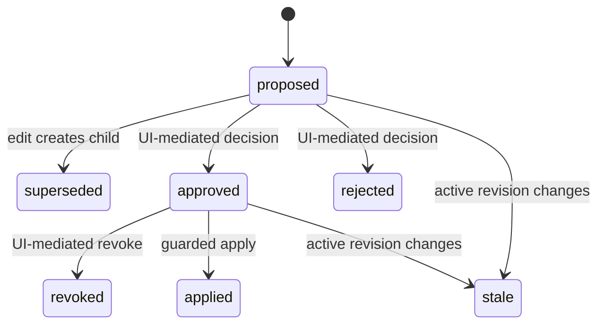

# Focus Contract Studio — Domain Model and Invariants

Status: **IMPLEMENTATION CONTRACT v2**

## Fixed value objects

```ts
type FocusTargetId =
  | "dialog-title"
  | "reason-input"
  | "cancel-button"
  | "delete-button"
  | "delete-trigger";

type ImplementedFocusConfiguration = {
  initialFocus: "dialog-title" | "reason-input" | "cancel-button" | "delete-button";
  focusOrder: Array<"reason-input" | "cancel-button" | "delete-button">;
  trapTab: "wrap";
  trapShiftTab: "wrap";
  escapeAction: "close";
  returnFocus: "delete-trigger";
};
```

Rules: strict object; each rendered tabbable target exactly once; `initialFocus` is present or `dialog-title` has `tabindex=-1`; no selectors, HTML, scripts, URLs, free-form targets, locale-dependent values, or unknown fields.

## Canonical proposal and hash

Exact key order:

`evidenceQueryId` is generated server-side only after the submitted evidence token is verified and its accepted retrieval snapshot is persisted. It is never caller input.

```json
{
  "schemaVersion": 2,
  "variantId": "<server-resolved opaque id>",
  "baseImplementedRevision": 1,
  "configuration": {
    "initialFocus": "cancel-button",
    "focusOrder": ["reason-input", "cancel-button", "delete-button"],
    "trapTab": "wrap",
    "trapShiftTab": "wrap",
    "escapeAction": "close",
    "returnFocus": "delete-trigger"
  },
  "evidenceQueryId": "<id>",
  "evidenceRecordIds": ["<sorted unique id>"],
  "summary": "<NFC, trimmed, internal whitespace preserved>",
  "authorKind": "agent | reviewer"
}
```

UTF-8 JSON, no insignificant whitespace, fixed key order, configuration array order preserved, evidence IDs sorted, Unicode NFC, no `undefined`/float/date/locale serialization. `proposal_hash = lowercase_hex(SHA-256(bytes))`. Fixed positive/negative vectors are release tests.

## Entities

All ordinary tables are `STRICT` where D1 supports the declared types. Opaque IDs are random UUIDs/128-bit-equivalent. Every workspace-owned child carries `workspace_id`; composite constraints/indexes prevent accidental cross-workspace joins.

| Entity | Purpose and critical constraints |
|---|---|
| `workspaces` | Isolation/lifecycle: subject kind/key, created/access-expiry/grace/purged timestamps. One current workspace per anonymous session or optional signed subject. |
| `component_variants` | Workspace/product/family/use-case/slug and `active_implemented_revision`; unique workspace+slug. |
| `workspace_view_state` | One active variant per workspace plus view revision; UI selection is allowlisted and CAS-protected. |
| `implemented_focus_revisions` | Append-only renderer configurations; unique variant+revision; parent/source proposal/undo; canonical JSON/hash. Revision 1 is Delete; renderer always reads active pointer. |
| `observation_sessions` | Workspace/variant/implemented revision, environment, nonce, state, timestamps, event/manifest digests. |
| `rendered_manifests` | One immutable actual-DOM allowlisted snapshot per session: present target IDs, tabbable DOM order, role/modal attributes, manifest version/hash. |
| `observation_events` | Immutable ordered allowlisted facts; session+sequence unique; no text/value. |
| `precedent_records` | Synthetic seed or verified runtime precedent; dataset, scope, behavior, normalized outcome, status/validity, rationale/tags, immutable provenance. |
| `precedent_subject_edges` | `record_id`, workspace, `target_kind` (`context`,`variant`,`use_case`,`family`), `target_key`, edge type/weight; unique typed edge. |
| `precedent_lineage` | Record-to-record supersession/confirmation/conflict lineage. No polymorphic subject targets here. |
| `retrieval_queries` | Proposal-bound accepted evidence snapshot: raw/validated context, deterministic query text, algorithm/prefilter/dataset versions, token issue/as-of, context/result digest. Pure reads do not create rows. |
| `retrieval_results` | Proposal-bound eligibility reasons, three ranks/contributions, structured score, relationship tier, RRF score/order/disposition. |
| `proposals` | Immutable target configuration, base implemented revision, hash, changed-field support map, author kind, lineage, status projection. |
| `proposal_evidence` | Proposal/query/record/field/outcome support links; cited record must have been eligible top-three for that query. |
| `review_decisions` | Append-only UI-mediated approve/reject/revoke bound to proposal/hash/base/session/reviewer/time. |
| `application_guards` | Conditional authority row for one attempt; unique proposal and same-base contender constraints. |
| `application_receipts` | Proposal/hash/from/to revision/idempotency/result/time; exactly one per successful proposal. |
| `application_commits` | Finalizer row whose trigger proves complete multi-row apply before commit. |
| `verification_receipts` / `verification_checks` | Unique session+verifier result, raw digests, six behavior checks, revision active-at-verification. |
| `idempotency_records` | Workspace+operation+key unique; canonical request hash; state (`started`,`committed`); result kind/id. Covers proposal, review, apply, undo, reset. |
| `audit_events` | Append-only safe product history with actor kind, action, target, result, correlation ID, time. |
| `rate_limit_windows` | Keyed digest bucket, operation, window, count, expiry. Proposed defaults only until deployed load tests pass. |

## State machines

### Proposal



Append-only records plus a deterministic reducer are authoritative; a status column is only a CAS-protected projection.

### Observation

`recording -> finalized -> verified_pass | verified_fail`; incomplete sessions expire. Finalized manifest/events never change.

### Revision

Apply and undo each create a new implemented revision. No pointer rewind or deletion.

## Workspace and ID invariants

- Workspace is resolved from the server session; no route/tool accepts it.
- Every query starts with the authoritative workspace predicate.
- Foreign and nonexistent proposal/rehearsal/receipt IDs return the same relevant `*_NOT_FOUND` response, status, size class, and timing budget. Private logs may record scope detail.
- Public seeded slugs select allowlisted UI state only; they never authorize records.

## Precedent eligibility and projection

- Seed records are synthetic and immutable.
- Runtime record projection occurs only with a `pass` verification receipt for an implemented revision created from a UI-approved exact proposal.
- One changed behavior field produces one normalized record with review/application/verification provenance and typed subject edges.
- Projection never creates/revokes approval and never auto-supersedes another record.
- Divergent active exact-scope outcomes return `conflict`. Supersession requires a new explicit UI-mediated resolution workflow; outside the hero, conflict blocks changed agent proposals.
- Same-outcome records can be grouped for display but remain individually auditable.

## Agent proposal evidence invariant

For each changed field, the canonical proposal stores a support tuple:

```ts
type FieldEvidenceSupport = {
  field: keyof ImplementedFocusConfiguration;
  recordId: string;
  behavior: "initial-focus" | "focus-order" | "forward-wrap" | "backward-wrap" | "escape" | "return-focus";
  normalizedOutcomeKey: string;
};
```

The server verifies the unexpired evidence token by rerunning the frozen retrieval at the token issue instant, then derives the expected normalized outcome from each proposed field value and requires a cited token-bound eligible top-three record with the same behavior/outcome. The guarded proposal batch reasserts the active workspace/variant/revision and observation/context digest used by the rerun before it inserts the accepted query/results, support links, and proposal. Precedent rows are immutable; later projections use server-current `validFrom`, so they cannot backdate into the token-time result. No support means `EVIDENCE_REQUIRED_FOR_AGENT_CHANGE`. Retrieval score is irrelevant to mutation authorization; it only establishes the bounded cited evidence set. Reviewer-authored novel proposals are allowed only through the visible route with a no-precedent warning and still require a separate review decision.

## Exact guarded mutation invariant

For any multi-row mutation:

1. Preliminary reads are diagnostic.
2. A conditional guard insert contains every authoritative predicate and idempotency request hash.
3. All product writes select/join the guard or the created primary row.
4. A finalizer trigger raises an error unless every required row and pointer/status relation exists.
5. Code asserts exact `meta.changes` per statement.
6. Guard zero rows means zero product mutation and a stable error; required downstream zero means rollback.
7. Success audit is inside the batch. A safe failed-attempt audit may be a separate best-effort write but cannot resemble a success receipt.

### Apply predicates

- same workspace and active variant;
- effective proposal is approved, not revoked/rejected/superseded/applied/stale;
- latest review binds exact proposal ID/hash/base revision;
- proposal hash recomputes exactly;
- caller expected, proposal base, and active implemented revisions are equal;
- idempotency is unused or byte-identical committed replay;
- proposal evidence remains historically resolvable, but retrieval never substitutes for review.

Apply success creates exactly one revision, advances exactly one pointer, creates one receipt/idempotency result/success audit, marks proposal applied, and stales same-base open siblings.

## Idempotency contract

| Operation | Scope and recovery |
|---|---|
| Create proposal | workspace + `create_proposal` + key + canonical request hash → proposal receipt. |
| Review decision | workspace + decision type + key + proposal/hash → review record. |
| Apply | workspace + `apply` + key + proposal/expected revision → application receipt. |
| Undo | workspace + `undo` + key + source receipt/current revision → new revision receipt. |
| Reset | current session + `reset` + key + prior workspace generation → new seeded workspace receipt. |
| Verify | natural key session+verifier version; byte-identical replay returns receipt. |

Same key/different hash returns `IDEMPOTENCY_CONFLICT`. Lost response is always recovered by retry/read receipt; UI never guesses.

## Raw observation grammar

```ts
type ObservationEvent =
  | { type: "dialog_open"; targetId: "delete-trigger" }
  | { type: "focusin"; targetId: FocusTargetId }
  | { type: "keydown"; key: "Tab" | "Escape"; shift: boolean; targetId: FocusTargetId }
  | { type: "dialog_close"; reason: "escape" | "cancel" | "delete" }
  | { type: "focus_return"; targetId: "delete-trigger" };
```

Server assigns monotonic sequence; bounded client-relative monotonic time is diagnostic. Maximum 64 events/30 seconds. Unknown targets/events, duplicate/out-of-order sequences, or overflow finalize invalid. Event/manifest digests are canonical SHA-256 values.

## Verification invariant

- Session is finalized and matches workspace, variant, requested implemented revision.
- Verifier receives only immutable manifest/events and configuration; no retrieval/model/benchmark expected-event import.
- It evaluates all six fields; `not_observed` makes overall fail.
- Receipt records whether revision was active when verified.
- Deliberate planted deviations for every behavior must fail.

## Public error envelope

```ts
type PublicError = {
  ok: false;
  error: {
    code: string;
    message: string;
    retryable: boolean;
    correlationId: string;
  };
};
```

No stack, SQL/binding, cookie/CSRF, subject key, foreign workspace, raw untrusted payload, or existence oracle appears publicly.
