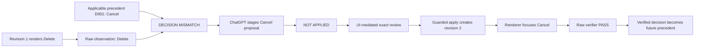

# Focus Contract Studio — Product Truth

Status: **CONTROLLING PRODUCT AUTHORITY**  
Authority revision: **2.0**  
Decision cutoff: **2026-08-29 EDT**  
Submission deadline: **2026-09-03 20:00 UTC / 16:00 EDT / 13:00 PT**

## Confidence language

- **[Empirical]** Official current documentation/rules or a directly recorded test result.
- **[High-Conviction]** The selected implementation derived from evidence and locked constraints.
- **[Hypothesis]** Unproven. The exact validating test must be named and the statement cannot become submission copy until it passes.

## Identity

- **Name:** Focus Contract Studio
- **Tagline:** Human precedent guides the next repair. Exact review controls permission.
- **Primary user:** Accessibility or design-system lead inside one product company.
- **Product sentence:** A reviewer and ChatGPT inspect one live dialog, retrieve applicable prior decisions, stage an unapplied implemented-configuration change, approve it through the visible UI, apply it with guarded revision checks, and verify the rendered keyboard behavior independently.

## Problem and answer

Teams repeatedly decide interaction behavior, but the prior rationale, current implementation, agent proposal, reviewer authority, and observed result often live in separate places. A page-bound agent can help only if the system keeps five boundaries explicit:

1. **Observation:** what the current renderer actually did.
2. **Implemented revision:** what currently configures the renderer.
3. **Precedent:** what an earlier reviewer decided for an applicable context.
4. **Proposal and approval:** what change is staged and what exact payload the current reviewer approved.
5. **Verification:** what the renderer did after the applied revision.

Focus Contract Studio makes those boundaries visible and durable in one page.

## Locked release boundary

- Product: `focus-contract-studio`
- Component family: `modal-dialog`
- Use case: `delete-account`
- Variants: `delete-account-standard`, `delete-account-danger-emphasis`
- Implemented fields: `initialFocus`, `focusOrder`, `trapTab`, `trapShiftTab`, `escapeAction`, `returnFocus`
- Exactly four WebMCP tools: read, propose, apply approved proposal, verify.
- One public anonymous hero path. Optional sign-in is non-blocking and ships only if hosted probes pass.

Excluded: general accessibility compliance, WCAG certification, automatic source patching, external design-system integration, more component families, multi-tenant enterprise roles, production-scale search, a model API inside the Site, or a general Clivus integration.

## The coherent hero

### Seeded truth

- Implemented focus revision 1 has `initialFocus = delete-button`.
- The renderer obeys revision 1, so a fresh rehearsal observes Delete.
- Synthetic historical reviewer precedent D001 is active, exact-scope, and says `initial-focus -> cancel-button` with rationale.
- The page compares the observed/implemented outcome with applicable precedent and shows `DECISION MISMATCH`.
- The page does **not** claim revision 1 violates a stored target contract or a universal accessibility rule.

### Repair truth

1. `read_active_focus_review` returns revision 1, the raw observation, eligible precedent, and a short-lived evidence token. It does not separately expose a hidden desired answer and performs no product-state write.
2. ChatGPT creates an immutable `NOT APPLIED` proposal changing only `initialFocus: delete-button -> cancel-button`, citing D001.
3. The server verifies field-level evidence support. If D001 is removed, the same agent proposal is rejected with `EVIDENCE_REQUIRED_FOR_AGENT_CHANGE`; the visible reviewer UI can still author a novel proposal and visibly accept responsibility for it.
4. Creating the proposal leaves revision 1 and the renderer unchanged.
5. The reviewer inspects the exact diff and explicitly approves, rejects, edits-as-child, or revokes through the visible UI. No WebMCP/API approval operation exists.
6. Apply rechecks the proposal, hash, latest decision, base/current revision, workspace, and idempotency **inside one guarded D1 batch**. Success creates implemented revision 2.
7. The renderer reads revision 2 and focuses Cancel.
8. A new raw rehearsal is verified against revision 2; history, stale failure, reload, idempotent recovery, and revisioned undo remain visible.
9. Only after a UI-reviewed change is applied **and** independently verified `pass` is its review outcome projected into future runtime precedent with provenance. Seed benchmark records remain immutable and isolated from runtime projections.

## Authority boundary

| Actor | May do | May not do |
|---|---|---|
| ChatGPT/WebMCP | Read current page-bound state; cite evidence; create a proposal; request application of an already-approved proposal; request verification. | Approve/reject/revoke; choose a workspace; alter a stored proposal; bypass review, hash, revision, guard, or idempotency checks. |
| Reviewer UI | Rehearse; author/edit-as-child; approve/reject/revoke; apply; verify; undo; reset. | Rewrite immutable history or make stale approval current. |
| Retrieval | Return eligible records, contributions, conflict, or abstention. | Approve, authorize, verify, recommend with confidence, or override current review. |
| Server | Resolve identity/workspace; validate; hash; guard; persist; rate-limit; verify; issue receipts. | Trust client-selected ownership, model text, or tool annotations as authority. |
| Observer/verifier | Record bounded stable IDs and evaluate six behavior rules. | Capture typed values, synthesize expected events, or call retrieval/model logic. |

“UI-mediated reviewer” is the strongest truthful authority claim. The platform does not provide biological-human attestation.

## Memory value proof

There are two separate claims:

### Deterministic product claim

For an agent-authored changed proposal, every changed field must be supported by at least one cited eligible precedent outcome. The release test uses identical state and payload:

- **memory on:** D001 is eligible; Cancel proposal is accepted and remains unapplied;
- **memory off:** eligible corpus is empty; identical Cancel proposal is rejected `EVIDENCE_REQUIRED_FOR_AGENT_CHANGE`;
- unrelated, foreign, superseded, rejected, quarantined, expired, and conflicting records never satisfy support;
- evidence never creates approval.

This proves precedent materially affects the permitted proposal workflow.

### Model-behavior claim

**[Hypothesis]** The supported ChatGPT client will itself propose Cancel when D001 is present and abstain/request review when it is absent. Test: paired memory-on/off trials with fixed deployed version, model/client version, prompt, state reset, temperature/platform defaults, raw tool traces, predefined expected field or abstention, and a fixed trial count. Claim this only if the registered protocol passes.

## Evidence-gated submission claims

| Candidate claim | Required proof |
|---|---|
| ChatGPT operates the live page through WebMCP. | Deployed supported ChatGPT client discovers and calls all four tools; dated trace names client/model/version. |
| Proposal creation cannot mutate behavior. | Domain, route, adapter, D1, and browser tests show unchanged active revision/rendering after proposal creation. |
| Exact current UI review controls apply. | Missing, forged, stale, rejected, revoked, superseded, foreign, wrong-hash, zero-row guard, and concurrent cases all produce zero product mutation. |
| Precedent materially affects agent change admission. | Fixed memory-on/off counterfactual and negative-scope matrix pass. |
| Verification is independent. | Planted raw-event divergences fail; verifier has no import path from retrieval or expected-event generator. |
| RRF adds value safely. | Sealed v2 benchmark report passes every gate; invalid v1 remains disclosed. |
| State is durable and isolated. | Deployed reload, two-profile isolation, expiry/access, reset, replay, undo, and foreign-ID indistinguishability tests pass. |
| Chrome is supported. | Origin-isolation, `tools` policy, API discovery/calls, and release flow pass in the recorded Chrome version. Otherwise the matrix says `FAIL` or `INCONCLUSIVE` and describes any narrower observation without claiming support. |

## Market and impact claims

- **[Hypothesis]** Scoped precedent reduces repeat-review time. Test at least five relevant practitioners against a no-memory flow.
- **[Hypothesis]** Teams will pay. Test ten problem interviews and three paid/contract-backed pilots.
- **[Hypothesis]** The pattern transfers beyond dialogs. Test a preregistered second-family benchmark after the challenge.

Do not claim users, revenue, time saved, compliance, production readiness, or general retrieval quality without direct evidence.

## Completion

The release is complete only when the fresh signed-out judge journey works, automated/manual/reviewer gates pass, the deployed Sites version maps to frozen source commit `C`, a separate immutable release attestation maps all external artifacts back to `C`, the public repository and Apache-2.0 license are available, the narrated public YouTube video is at most 170 seconds and shows product in the first 10–15 seconds, the Devpost form is complete, and nothing is mutated after the deadline without written organizer authorization.

## Reuse statement

No Clivus code or data is copied. RRF is a clean-room implementation of the published rank-only formula. The reused architectural insight is independently restated here: **retrieved memory is evidence; authorization is a separate deterministic capability.**
