# Focus Contract Studio — Codex End-to-End Implementation Plan

Status: **READY TO EXECUTE**  
Authority revision: **2.0 — 2026-08-29 EDT**  
Target effort: **52–58 focused hours**  
Execution model: **one Sites-owning root agent; bounded read-only review waves; tests, evidence, and docs inside every package**

## Outcome

Deliver one public, accessible, WebMCP-native ChatGPT Site; one public Apache-2.0 repository; one immutable release lineage; one narrated public YouTube demo of at most 170 seconds; and one frozen Devpost entry. Product code does not begin until Package 0 verifies the generated Sites runtime. No work package is complete without its exit tests and evidence.

## Immutable product spine

1. Revision 1 is the implemented renderer configuration and focuses Delete.
2. Applicable prior reviewer decision D001 says Cancel; the page shows `DECISION MISMATCH`.
3. Retrieval may support an agent-authored changed proposal but never approval.
4. Proposal creation is durable and visibly `NOT APPLIED`.
5. Approval is an exact UI-mediated reviewer decision; no approval tool or public approval API exists.
6. Guarded D1 execution creates revision 2 exactly once or creates nothing.
7. Revision 2 drives the renderer; independent raw browser events verify it.
8. Reload, stale/forged failure, idempotent recovery, history, and revisioned undo are visible.

If implementation contradicts one of these statements, stop that package and repair the implementation or controlling authority before proceeding.

## Critical path

```mermaid
flowchart LR
    P0[0 Scaffold + hosted probes] --> P1[1 Session + D1 spine]
    P1 --> P2[2 First live WebMCP slice]
    P2 --> P3[3 Observer + verifier]
    P2 --> P4[4 Retrieval v2 + dev gates]
    P3 --> P5[5 Review + guarded apply + undo]
    P4 --> P5
    P5 --> P6[6 Premium accessible UX]
    P6 --> P7[7 Four-tool hardening]
    P7 --> P8[8 CI + security + evidence]
    P8 --> R1[Adversarial review 1]
    R1 --> C[Freeze source commit C]
    C --> LIVE[Same version owner-only then public]
    LIVE --> H[One-time holdout + manual/client gates]
    H --> R2[Adversarial review 2]
    R2 --> A[Release attestation + video + Devpost]
```

## Package 0 — Repository custody, scaffold, and blocking probes

Target: 3 hours.

Build:

- Confirm current directory, Git state, branch, HEAD, parent overlays, and target path.
- Create isolated `focus-contract-studio/` through the current official Sites creation workflow with D1 and optional auth capability. Record the actual generator version and option names; do not assume them or scaffold over this planning workspace.
- Inspect and obey the generated framework, package manager, Worker entry, local commands, configuration schema, binding names, and deployment workflow. Commit the untouched generated scaffold first.
- Copy the complete authority pack and sealed v2 fixtures byte-for-byte; verify `SHA256SUMS-v2` before committing them.
- Add Apache-2.0 `LICENSE`, root `AGENTS.md` derived from the build contract, minimal README, and evidence directories registered in `EVIDENCE_REGISTRY.md`.
- Run the bootstrap probes before feature code:
  - local build and Worker request;
  - fresh local D1 migration/prepared query/foreign-key/unique/guarded-batch behavior;
  - prove D1 `batch()` rollback on statement error and separately prove a zero-row conditional write is a successful statement with `meta.changes=0` that the application must reject;
  - one top-level imperative `document.modelContext.registerTool` probe, abort signal, execute cancellation signal, duplicate-registration cleanup, and bounded output;
  - hosted cookie attributes and public/owner access modes;
  - exact authenticated-email header anti-spoofing and repeat-sign-in byte stability;
  - current Cloudflare Vitest integration compatibility;
  - current Chrome WebMCP path as conditional evidence, not a release dependency.

Tests and evidence:

- `build`, typecheck, lint, fresh D1 test, minimal local request, and real supported ChatGPT live probe.
- `docs/evidence/BOOTSTRAP_PROBES.md` records source, date, environment, version, procedure, raw artifact, and `PASS`/`FAIL`/`INCONCLUSIVE`.
- Optional sign-in ships only if both hosted identity probes pass. Chrome is claimed only if its current path passes.

Exit gate: generator/runtime facts are observed, the sealed fixture hashes match, a supported ChatGPT client calls the live probe, and no product invariant depends on a guessed platform behavior.

## Package 1 — D1 schema, anonymous session, and domain skeleton

Target: 6 hours.

Build:

- Implement the exact entities, constraints, indexes, value objects, and transition vocabulary from `DOMAIN_MODEL.md`.
- Use additive numbered migrations only. Never assume saved versions have separate D1 data.
- Create anonymous signed, HttpOnly, Secure, SameSite session cookies; server-resolve every workspace.
- If Package 0 passed optional identity, HMAC the exact validated authenticated-email header bytes without lowercasing or provider normalization; never persist email/name.
- Implement deterministic isolated workspace seed, two variants, implemented revision 1, precedent D001, bounded reset, and request-driven expiry cleanup.
- Implement strict schemas, common safe error envelopes, CSRF/origin checks, size limits, and unavailable-ID response parity.

Tests and evidence:

- Fresh/repeated/upgrade migration tests, deterministic seed, reset isolation, forged/expired cookie rejection, two-profile isolation, foreign-versus-nonexistent response parity, and query-plan assertions.
- Database inspection proves no raw email, name, IP, token, typed value, or private corpus exists.

Exit gate: two independent sessions cannot observe or mutate each other; reload preserves current state; every declared query uses the expected index or has a documented bounded scan.

## Package 2 — First meaningful live WebMCP slice

Target: 5 hours.

Build:

- Render the native Delete Account dialog from implemented revision 1; opening it focuses Delete.
- Capture the first bounded raw `focusin` observation and show revision 1, D001, and `DECISION MISMATCH` in the first viewport.
- Implement shared `getActiveFocusReview` and `createProposal` operations. The read creates no D1 rows and returns a domain-separated, session/workspace/state/result-bound five-minute evidence token.
- On create, rerun frozen retrieval as of the token issue second; reject malformed/tampered/expired/future/cross-session/cross-workspace/revision/context/result/citation mismatch; atomically persist the accepted retrieval snapshot, support links, and immutable proposal.
- Implement the deterministic changed-field evidence-support rule. With D001 eligible, the Cancel proposal is accepted and remains unapplied; with no eligible precedent, the identical agent proposal fails `EVIDENCE_REQUIRED_FOR_AGENT_CHANGE`.
- Register only `read_active_focus_review` and `create_focus_contract_proposal` for this package through the same domain operations.

Tests and evidence:

- Contract snapshots, fixed token vectors and full tamper/expiry/boundary matrix, read-no-write assertion, atomic evidence+proposal failure injection, domain and D1 tests, proposal idempotency, memory-on/off counterfactual, proposal-does-not-apply assertion, dialog focus test, registry lifecycle tests, and one Playwright vertical journey.
- Deploy an intermediate version with the narrowest documented access mode and run one real ChatGPT read/create flow. Treat it as production and use synthetic data only.

Exit gate: live ChatGPT reads exact page state and creates a durable `NOT APPLIED` proposal while revision 1 and rendered behavior remain unchanged.

## Package 3 — Raw observer and independent verifier

Target: 4 hours.

Build:

- Implement rehearsal start/finalize, immutable rendered-target manifest, bounded ordered `keydown`/`focusin` events, event digest, and retention limits.
- Store stable element IDs and behavior metadata only; never typed values, arbitrary text, DOM snapshots, or keystroke content.
- Implement `focus-event-verifier-v1` for initial focus, focus order, forward wrap, backward wrap, Escape action, and return focus.
- Bind every verification to workspace, implemented revision, finalized session, manifest digest, verifier version, and idempotent receipt.

Tests and evidence:

- Positive exact traces; missing-event and `not_observed` cases; tampered/reordered/foreign/stale sessions; immutability after finalize; and one deliberate divergence per behavior.
- Static dependency rule prevents observer/verifier imports from retrieval, proposal target construction, or benchmark judgments.

Exit gate: revision 2 behavior can pass only from real matching events; every planted divergence fails independently; changing expected fixtures cannot create observed evidence.

## Package 4 — Frozen retrieval v2 and development benchmark

Target: 5 hours.

Build:

- Revalidate v2 schemas, counts, references, answer-neutral query construction, calibration, and `SHA256SUMS-v2`. Preserve v1 unchanged and labeled invalid.
- Implement one indexed eligibility query capped at 36 records.
- Implement frozen eligible-only TypeScript BM25, structured applicability rank, subject-edge rank, full-precision RRF `k=60`, stable ties, explanations, conflict, and abstention exactly as specified.
- Keep benchmark adapters outside production request paths. Production code cannot import expected judgments, reference evaluator, calibration outcomes, or holdout.
- Run product implementation only against 12 development cases and published development goldens.

Tests and evidence:

- Every eligibility exclusion, hostile content, wrong workspace, supersession, expiration, malformed record, conflict, abstention, rank vector, tie, output bound, and 100-repeat determinism.
- Static import/dependency scan, D1 query-plan evidence, dev baseline/ablation report, and benchmark schema/hash verification.

Exit gate: 12/12 development dispositions, zero forbidden records, golden parity, deterministic bytes, and all development gates pass without opening the v2 release holdout.

## Package 5 — Review, guarded apply, receipts, history, and undo

Target: 7 hours.

Build:

- Implement immutable child proposals, UI-mediated approve/reject/revoke, exact digest/base-revision panel, and chronological decision history.
- Implement apply input containing only proposal ID, expected implemented revision, and idempotency key.
- Re-read all authority inside the command. Every D1 write repeats the same application guard; use an application-attempt/finalizer design whose trigger raises and rolls back if all expected guarded rows were not produced. Inspect every returned `meta.changes`; zero-row is failure.
- Create exactly one revision, active-pointer change, application receipt, audit event, and stale-proposal updates on success. Same-key retry returns the original receipt.
- Implement verification request, verified-precedent projection, undo as a new revision, and current-workspace reset.

Tests and evidence:

- Full state transition table and apply negative matrix: missing/unavailable/foreign, unsupported evidence, unapproved, rejected, revoked, superseded, hash mismatch, stale base, conflicting idempotency payload, expired session, CSRF/origin, and malformed input.
- Inject failure at every batch statement; explicit zero-row conditional-write case; 100 paired concurrent same-base applies with exactly one winner; lost-response same-key recovery; reload after every state.

Exit gate: all invalid paths create zero product mutation; success/retry/concurrency produce exactly one valid revision and one receipt; old approvals cannot reapply after undo.

## Package 6 — Premium accessible product surface

Target: 4 hours.

Build:

- Implement the complete UX spec: first-viewport story, focus playground, evidence cards, unapplied proposal diff, exact review controls, application/verification receipts, history, undo, reset, and compatibility notice.
- Implement loading, empty, abstention, conflict, validation, rate-limit, stale, uncertain-network, unsupported-WebMCP, success, and recovery states.
- Use semantic HTML/native dialog, persistent labels, non-color status, visible focus, logical source order, live announcements, reduced motion, and responsive CSS without a component framework.
- Preserve exposed dialog name/description/modal semantics and background inertness for both pointer and keyboard interaction throughout every open-dialog state.

Tests and evidence:

- Testing Library state/interaction tests; Playwright keyboard journeys at desktop, 320 px, and 375 px; 200% zoom/reflow; explicit dialog-semantics and blocked-background pointer/keyboard assertions; focused-element bounds/occlusion assertions in all four viewport/zoom conditions; reduced motion; axe; visual inspection of every state; and copy/source-order audit.
- On the exact deployed version, founder manual evidence separately dispositions dialog semantics/background inertness and every focused actionable control remaining inside the visible, unobscured viewport in all four conditions.

Exit gate: the complete human workflow works without WebMCP, no high-impact automated accessibility issue remains, and a cold evaluator answers all five `UX_SPEC` questions within 15 seconds, including that verification compares a new raw rehearsal with the named implemented revision rather than proving approval or general conformance.

## Package 7 — Four-tool WebMCP completion and hardening

Target: 3 hours.

Build:

- Register exactly the four v2 imperative tools with strict Draft-07 input schemas, accurate annotations, abortable singleton lifecycle, cancellation handling, current-page freshness, common safe errors, and compact results targeting no more than 1,500 characters.
- Keep adapters thin. UI and tools call the same application operations; review, rehearsal capture, undo, reset, and workspace selection remain unexposed.
- Remove all temporary probe tools.

Tests and evidence:

- Schema snapshots, annotation checks, unsupported API, duplicate navigation/HMR, stale page, cancellation before/after request, hostile rationale, oversized output, lost mutation response, idempotent replay, and WebMCP/UI parity.
- Real-client trace in supported ChatGPT. Conditional Chrome trace only if Package 0 passed.

Exit gate: exactly four tools appear and behave as contracted; create never applies; apply cannot approve; unsupported WebMCP leaves the complete human workflow intact.

## Package 8 — Security, CI, documentation, and evidence automation

Target: 5 hours.

Build:

- Finish security headers, WebMCP `tools` Permissions Policy/origin isolation as supported, session rotation/TTL, limits, request-driven cleanup, log redaction, and privacy disclosure.
- Add canonical `verify` command, CI, clean database setup, deterministic seed, benchmark-dev command, evidence validators, local-link checker, release-lineage checker, and README run/test/deploy/architecture/security/accessibility/AI-use/limitations sections.
- Add dependency/license inventory, required notices, secret scan, history scan, bundle scan, and provenance ledger.
- Commit `release/BUILD_INPUTS.json` schema/template containing only pre-deploy inputs; it must never claim its own hash or post-deploy facts.

Exit gate: clean clone installs/builds/verifies, coverage gates pass, no unresolved critical/high security or license finding remains, and all pre-live evidence registered in `EVIDENCE_REGISTRY.md` exists.

## Adversarial review 1 — Local release-candidate audit

Target: 3 hours. One bounded read-only wave of at most three reviewers:

1. authority, workspace isolation, guarded D1 mutation, idempotency, and security;
2. WebMCP contract, retrieval/benchmark separation, verifier independence, and claim truth;
3. UX, accessibility, cold-judge comprehension, submission risk, and missing evidence.

Root reproduces every finding, records severity/disposition, implements permanent fixes, reruns affected/full suites, and closes reviewers. Evidence: `docs/evidence/ADVERSARIAL_REVIEW_1.md`.

Exit gate: no open high-severity issue and no correctness-relevant medium without documented resolution and test.

## Package 9 — Exact source freeze and public release qualification

Target: 5 hours plus founder checkpoints.

1. Recheck current Devpost rules/updates and official Sites/WebMCP docs.
2. Run clean-clone `verify`, production build, security/license/secret scans, fixture hashes, and evidence completeness.
3. Generate and commit final `release/BUILD_INPUTS.json`; commit/push/tag the exact public source commit `C`. Record full SHA. No post-deploy values are placed in `C`.
4. Save a Sites version built from `C`; record the generated Sites project/version identity outside `C`.
5. Deploy that version with owner-only access. This is still a production deployment using the real D1 database; apply only additive migrations and synthetic test data.
6. Run owner live checks. Ask the founder for the explicit public-access action only after they pass.
7. Expose/deploy the same saved version publicly. Prove signed-out access, two-profile isolation, full hero/reload/undo, headers, rates, accessibility automation, availability, and release marker.
8. Run real supported ChatGPT acceptance; run Chrome only if conditionally supported.
9. An independent reviewer opens the v2 holdout once, runs the exact-source benchmark, and stores the raw report. Required exact pre-seal target: holdout mean nDCG@3 `0.975817`, lift over strongest ranker `0.072547`, MRR@3 `0.958333`, Recall@3 `1.0`, 18/18 dispositions, zero forbidden results, and 100-repeat determinism, plus hosted latency gates.
10. Founder performs the named VoiceOver/manual session; cold evaluator runs the scripted comprehension check.

Any code, fixture, migration, or configuration fix creates a new source commit `C`, saved version, deployment, and complete qualification cycle. Do not patch the deployed release invisibly.

Exit gate: public exact-version journey, supported ChatGPT matrix, conditional clients, holdout, manual accessibility, and all registered release gates pass.

## Adversarial review 2 — Exact deployed release

Target: 2 hours.

A fresh reviewer attacks the public exact release, source lineage, stale/forged/hostile paths, cold comprehension, accessibility, evidence integrity, and every intended submission claim. Root fixes only through a new complete Package 9 cycle. Evidence: `docs/evidence/ADVERSARIAL_REVIEW_2.md`.

Exit gate: no known high-severity issue, no unsupported claim, and all evidence points to the current `C` and Sites version.

## Package 10 — Release attestation, video, Devpost, and freeze

Target: 5–8 hours.

- Capture four exact-release screenshots.
- Rehearse the reset-to-verified-undo hero three times; record one 165–170 second English narrated demo showing the product in the first 10–15 seconds.
- Verify video duration, both-channel audio, text legibility, public YouTube playback while signed out, and file hash.
- Complete every standard and custom Devpost field from pre-submission evidence `E-001` through `E-028`. Founder supplies truthful residence/eligibility, approves the final video/copy, and explicitly authorizes external submission.
- Validate live URL, repository, license, video, screenshots, field completeness, and claims while signed out. Submit with buffer and capture confirmation as `E-029`.
- Generate `.artifacts/release/RELEASE_ATTESTATION.json` only after the submission receipt exists. It maps source commit `C`, Git tag, Sites project/version/deployed URL/timestamps, build-input and fixture hashes, final evidence index, tested clients, video, and submission receipt. It is not committed into `C`; validate/hash/publish it and the final index as frozen GitHub Release assets or equivalent before the deadline.
- Freeze repository source, Site version/access, video, screenshots, description, and entry through judging.

Exit gate: Devpost confirmation is captured; all public links work; the post-submission attestation closes one coherent release lineage; no artifact changes after final freeze.

## Calendar cutoffs

These are execution targets, not claims that work is already complete:

| Local deadline (EDT) | Required state |
|---|---|
| Aug 29, 18:00 | Authority revision 2 closed; v2 calibration and hashes sealed. |
| Aug 30, 12:00 | Package 0 probes and minimal live ChatGPT tool complete. |
| Aug 30, 22:00 | First meaningful live read/create vertical slice complete. |
| Aug 31, 18:00 | Domain, guarded apply, observer/verifier, and development retrieval gates complete. |
| Sep 1, 12:00 | Full four-tool loop and history/undo complete. |
| Sep 1, 20:00 | Feature freeze; UX and automated quality gates complete. |
| Sep 2, 09:00 | Review 1 closed; source commit `C` frozen. |
| Sep 2, 13:00 | Public acceptance, one-time holdout, VoiceOver/manual, and Review 2 complete. |
| Sep 2, 18:00 | Public repository, screenshots, video export/upload complete. |
| Sep 2, 22:00 | Devpost submitted and confirmation captured. |
| Sep 3 morning | Read-only availability/link check only. |
| Sep 3, 16:00 | Official EDT deadline; no mutations without written organizer authorization. |

## Scope pressure rule

If work exceeds the target, remove decorative polish that does not affect first-viewport comprehension or a release gate. Never remove the WebMCP proof, evidence-versus-authority boundary, independent verification, isolation, guarded mutation, retrieval benchmark integrity, accessible human fallback, public judge path, tests, documentation, or release evidence. Never add another component family, customer integration, model API, collaboration system, external database, or alternate host.

## Definition of done

- Every checklist item and traceability row is `PASS` with exact evidence.
- No placeholder, hidden TODO, skipped release test, fabricated trace, known high issue, or unsupported claim remains.
- The anonymous public journey completes from reset through verified revision 2 and revisioned undo.
- Exactly four live tools pass in a supported ChatGPT client; conditional clients are labeled honestly.
- Benchmark v1 remains invalid; v2 exact-source report passes every frozen gate without product-code access to holdout judgments.
- Public repository source commit `C`, saved/deployed Sites version, evidence, video, screenshots, and Devpost entry are joined by the immutable post-deploy release attestation.
- The entry is frozen through judging and monitored without post-deadline mutation.
