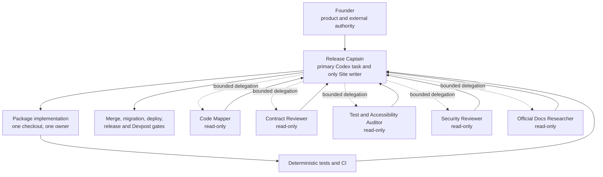

# Focus Contract Studio — Codex Team Operating Playbook

Status: **READY FOR BEGINNER ONBOARDING AND EXECUTION**  
Research refreshed: **2026-08-29 EDT**  
Audience: founder/operator with no assumed Codex or Git expertise  
Product authority: `START_HERE.md` and the files it names still control the build

## Bottom line

There is no documented “100% power” switch. The full-capability setup is a controlled delivery system:

1. one clear outcome per Codex task;
2. durable project rules in `AGENTS.md`;
3. one writer for each mutable checkout or branch;
4. read-only subagents for parallel research, mapping, testing, and review;
5. Git worktrees for truly independent coding tasks;
6. deterministic tests and CI before model review;
7. a human-controlled merge, deployment, credential, migration, and submission boundary;
8. scheduled tasks only after the same workflow succeeds manually.

For Focus Contract Studio, the current controlling contract is stricter: **one root Codex task owns all Site creation, configuration, product-source mutations, migrations, and deployments**. Other agents may inspect, challenge, research, and verify in parallel, but they must not edit the Site checkout. This is not reduced capability; it is the correct use of capability for a stateful hackathon Site with a single deployment and database lineage.

## Confidence language

- **[Empirical]** Current official OpenAI documentation, current local inventory, or a directly observed result.
- **[High-Conviction]** An engineering recommendation derived from those facts and this product’s authority pack.
- **[Hypothesis]** An unverified claim, followed by the test that would validate it.

## 1. The seven Codex building blocks

| Building block | Plain-English meaning | Best use | What it is not |
|---|---|---|---|
| Project | A folder plus the tasks that share its context | Keep the product repository, tasks, and local tools together | A replacement for Git |
| Primary task | The lead developer for one coherent outcome | Planning, implementation ownership, integration, final proof | A forever-running employee |
| Goal mode | A long-running outcome with constraints and verification | Multi-step work that should persist until its definition of done passes | Permission to bypass approvals |
| Subagent | A specialist spawned inside one task and summarized back to the lead | Code mapping, docs research, test analysis, security and accessibility review | A safe second writer in the same checkout |
| Worktree task | A separate checkout and branch context | An independently mergeable coding outcome | Shared editing of one branch |
| Skill | A reusable method, checklist, templates, and references | Repeatable reviews, releases, research, or evidence collection | A scheduler or external service connection |
| Plugin/MCP | An installable capability or a connection to an external tool/data source | GitHub, documentation, browser, Devpost, Sites, security tooling | Authority to perform every action exposed by that tool |
| Scheduled task | A new bounded run at a cadence or event | Stable maintenance, reports, scans, and checks | A continuously conscious 24/7 agent |

**[Empirical]** Current Codex releases enable subagent workflows by default. Official guidance recommends them first for independent, read-heavy work and warns that parallel write-heavy work increases conflicts and coordination cost. Subagents also consume additional tokens. See [Subagents](https://learn.chatgpt.com/docs/agent-configuration/subagents).

**[Empirical]** Worktrees are isolated Git checkouts that allow separate branches to progress in parallel. They require a Git repository, and one branch cannot be checked out in two worktrees simultaneously. See [Git worktrees](https://learn.chatgpt.com/docs/environments/git-worktrees).

## 2. What OpenAI has publicly said about its own use

We cannot inspect OpenAI’s private internal processes. We can state only what OpenAI has published:

- **[Empirical]** OpenAI’s current Codex best-practices guide says Codex reviews 100% of pull requests at OpenAI. The same guide recommends goal/context/constraints/done-when prompts, `AGENTS.md`, validation, skills, MCP, and scheduling only after a workflow is stable. See [Codex best practices](https://learn.chatgpt.com/guides/best-practices).
- **[Empirical]** One published OpenAI engineering workflow uses a notebook as durable context: Codex reviews a prior run, writes a plan, waits for human approval, executes, and records commands, outputs, and interpretation. The engineer retains consequential decisions. This is one documented example, not proof that every OpenAI team works identically. See [Automating repetitive work at OpenAI with Codex](https://developers.openai.com/blog/automating-repetitive-work-at-openai-with-codex).

The transferable pattern is **human-governed autonomy**: Codex does substantial bounded work; people retain product truth, consequential approvals, and release authority.

## 3. Current machine and project readiness

Observed locally on 2026-08-29:

| Capability | Observed state | Decision |
|---|---|---|
| Codex desktop/CLI | Standalone CLI `0.151.0`; install and npm package roots agree; strict config parsing passes | Ready |
| Git | `2.50.1` | Ready |
| GitHub CLI | `2.92.0`, authenticated through the macOS keyring as `chvignesh07` over HTTPS | Ready; verify the exact target repository and branch before any external write |
| Node.js | `22.22.3` | Available; the generated Sites starter will decide its supported version |
| npm | `10.9.8` | Available |
| pnpm | `10.34.5` | Available; use only if the starter selects it |
| Docker | Not reported | Do not install for this product; selected architecture does not require it |
| OpenAI Docs MCP | Enabled | Use for current OpenAI/Codex/Sites API facts |
| Security capability | Codex Security plugin is installed for the desktop environment; CLI has local security skills and a read-only security-reviewer role | Use at the security-review package and before release; verify the active surface in the client being used |
| Devpost Hackathons skills | Exposed in this project | Use for official rules, submission checks, and final packaging |
| ChatGPT Sites skills | Exposed in this project | Use for the one authorized Site creation and deployment workflow |
| Global operating contract | `~/.codex/AGENTS.md`, four read-only specialist roles, and a three-subagent cap are installed and prompt-verified | Ready |
| Skills routing | 1,112 inactive personal skills and 53 gstack entries are reversibly archived; 66 relevant skills are model-visible without a budget warning | Ready |
| Superpowers | OpenAI-curated 6.3.0 installed; ten audited implementation/review methods are CLI-visible and invocation-tested | Ready; brainstorming and competing orchestration methods intentionally remain inactive |

The plugin cache also contains GitHub, product-design, security, deep-research, and other capabilities. A cached or visible plugin is not proof that its external account is authenticated. Verify connection status immediately before a workflow needs it.

### Tools to install later, inside the generated repository

Do not globally install guessed framework packages. Package 0 must first create and inspect the official Sites starter. Then add only the exact project dependencies required by the locked technology selection:

- Vitest and Testing Library if the starter does not already provide compatible versions;
- Playwright and `@axe-core/playwright` for browser and accessibility verification;
- Zod 4 for strict schemas if absent;
- lint, type-check, secret-scan, license, and dependency-audit tooling selected after inspecting the starter;
- GitHub Actions in the repository, not as a laptop daemon.

Commit the untouched generated scaffold and lockfile before adding any dependency. Never paste an API key, session token, or credential into a Codex prompt or tracked file.

## 4. The correct team shape for this product



### Roles

| Role | Owns | Must not own |
|---|---|---|
| Founder | Product decisions, accounts, credentials, public release, final submission | Routine implementation choices already settled in authority docs |
| Release Captain | Plan, Site checkout, product code, D1 migrations, integration, package commits, deployment preparation | Inventing new product scope or silently changing founder decisions |
| Code Mapper | Execution paths, file/symbol map, dependencies, likely blast radius | Editing files |
| Contract Reviewer | Product invariants, WebMCP contracts, state transitions, stale/replay/idempotency risks | Editing files or approving a mutation |
| Test and Accessibility Auditor | Missing tests, browser journeys, keyboard/accessibility evidence, reproducibility | Treating automated accessibility checks as complete human proof |
| Security Reviewer | Sessions, CSRF/origin, isolation, secrets, data retention, guarded writes | Broad permission changes or credential handling |
| Official Docs Researcher | Current first-party APIs, versions, limitations, exact citations | Replacing observed runtime probes with documentation assumptions |

Run no more than three subagents in a bounded wave. The release captain cross-checks every finding against the repository before acting.

Before spawning a review wave, switch the parent turn’s active permission mode to read-only. The custom-agent files declare `sandbox_mode = "read-only"`, but current Codex behavior reapplies live parent permission overrides to children; the parent turn’s selected mode is therefore part of the safety boundary.

## 5. Two kinds of parallel work—do not confuse them

### A. Subagents inside one task

Use these when one lead agent needs several independent investigations. They return evidence to the lead; they do not create separate user-owned tasks or PRs.

Good examples:

- map backend and UI execution paths;
- verify an API against official docs;
- run independent security, test, and accessibility reviews;
- inspect logs or a large fixture corpus;
- compare the implementation to three different contracts.

Bad examples:

- three agents editing the same files;
- one agent changing a schema while another changes code that consumes the old schema;
- multiple agents deploying or migrating the same Site;
- asking vague agents to “build anything useful.”

### B. Separate tasks in Git worktrees

Use these in ordinary repositories when two coding outcomes are independently mergeable and have non-overlapping ownership. Each task receives its own worktree, branch, tests, and PR.

For Focus Contract Studio, the current build contract does not permit parallel Site-source writers. Use worktrees here for isolated review experiments or non-overlapping evidence artifacts unless the founder explicitly changes that contract after Package 0 proves the real generated boundaries.

**[High-Conviction]** A real software team does not maximize the number of writers. It maximizes verified throughput while maintaining one owner per mutable surface.

## 6. Initial Codex setup—one-time steps

### Step 1 — Keep this planning mirror read-only for product code

This folder contains the authority pack. Do not scaffold the application over it. Package 0 creates a separate `focus-contract-studio/` repository through the current official Sites workflow.

### Step 2 — Create the Site exactly once

In a new Codex task that targets the intended parent folder, use the ChatGPT Sites capability and the Package 0 prompt in section 13. That task becomes the Release Captain. It records the generated framework, package manager, commands, configuration, D1 binding, project ID, and hosted behavior before feature work.

Do not let another task initialize a second Site as a competing implementation.

### Step 3 — Establish Git custody

Inside the new product folder, the Release Captain must verify:

```text
current directory
Git repository root
current branch or detached state
HEAD commit
working-tree changes
configured remote
```

Commit the untouched generated scaffold first. Copy the authority pack and sealed retrieval fixtures next, validate their hashes, then commit that intake separately.

### Step 4 — Install the project Codex configuration

Copy these templates into the future product repository after the scaffold is committed:

```text
docs/delivery/codex-team/AGENTS.template.md      -> AGENTS.md
docs/delivery/codex-team/config.template.toml   -> .codex/config.toml
docs/delivery/codex-team/agents/*.toml          -> .codex/agents/*.toml
```

Replace every placeholder only with observed starter commands and real paths. Project-scoped Codex configuration should be committed only after review and used only in a trusted repository.

### Step 5 — Verify instruction discovery

From the future repository root, ask Codex to summarize the active instructions and name the files they came from. Official documentation also provides this CLI diagnostic:

```bash
codex --ask-for-approval never "Summarize the current instructions."
```

Repeat from a nested source directory if a nested `AGENTS.md` is later introduced. A closer instruction file overrides broader guidance for that subtree.

### Step 6 — Start with bounded permissions

Use `workspace-write` with `on-request` approval and automatic review for eligible sandbox escalations. Auto-review reduces routine pauses but does not broaden the sandbox or authorize public deployment, hosted migration, merge, credentials, billing, publication, or submission. Those external or consequential actions remain founder-controlled. Add narrow command rules or writable roots only when a repeated, known-safe need is demonstrated.

Never make `danger-full-access` plus `never` the everyday default. Official documentation states that this combination removes filesystem and network sandbox boundaries. See [Sandboxing](https://learn.chatgpt.com/docs/sandboxing).

### Step 7 — Connect GitHub only when the repository exists

Use GitHub CLI or the GitHub integration to create the remote and open PRs. Never invent or overwrite the remote URL. Before pushing, verify the target repository, account, branch, diff, and absence of secrets.

Recommended repository controls:

- protect `main`;
- require the canonical CI workflow;
- require at least one review for consequential changes;
- block force pushes and branch deletion on `main`;
- enable secret scanning where the account supports it;
- enable Codex PR review after Codex cloud is connected.

Official GitHub integration supports `@codex review`, automatic reviews, repository-specific review rules from `AGENTS.md`, and follow-up fixes. See [Review GitHub pull requests with Codex](https://learn.chatgpt.com/docs/third-party/github).

### Step 8 — Select models by work shape

Current official guidance and the model options exposed on this Codex host support this allocation:

| Work | Recommended current model class | Reasoning |
|---|---|---|
| Release Captain, ambiguous architecture, difficult implementation | GPT-5.6; the current host exposes GPT-5.6 Sol | High; XHigh only for genuinely complex blockers or adversarial review |
| Read-heavy review, exploration, supporting documents | GPT-5.6 Terra | Medium or High |
| Narrow high-volume lookup or simple bounded tasks | GPT-5.6 Luna | Low or Medium |

Do not change models mid-package without recording why. A faster agent is useful only when its output remains verifiable.

## 7. `AGENTS.md`, custom agents, skills, plugins, and MCP

### Use `AGENTS.md` for durable repository truth

Put in it:

- authority read order;
- build/test commands;
- product invariants and forbidden shortcuts;
- ownership and parallelism rules;
- definition of done;
- evidence language;
- repository-specific code review rules.

Do not put in it:

- temporary task details;
- credentials;
- every explanation from every design document;
- instructions that conflict with CI or product authority;
- vague aspirations such as “make it perfect.”

Codex loads global instructions and then project instructions from repository root toward the current directory; closer applicable files take precedence. The default combined instruction size is bounded, so keep the root file concise and link to controlling docs. See [Custom instructions with AGENTS.md](https://learn.chatgpt.com/docs/agent-configuration/agents-md).

### Use custom agents for narrow roles

Project roles live under `.codex/agents/*.toml`. Each current custom-agent file requires `name`, `description`, and `developer_instructions`; it may also set model, reasoning, sandbox, skills, or MCP configuration. The supplied templates intentionally use read-only sandboxes.

### Use a skill when the method repeats

Create a skill only after a workflow has been performed manually and can be specified with stable inputs, steps, checks, and output. Candidate future project skills:

1. `fcs-package-gate` — run the exact package exit checks and produce an evidence entry;
2. `fcs-release-audit` — validate frozen commit, deployment lineage, public journey, and artifact hashes;
3. `fcs-devpost-packager` — check submission fields, video duration, claims, links, and consistency.

Use `$skill-creator` to build one focused skill, test it on a real case, and revise it before scheduling. Skills define the method; schedules define when it runs. See [Skills and Plugins](https://learn.chatgpt.com/docs/skills-and-plugins).

The machine baseline keeps only a bounded active catalog. Selected Superpowers methods cover written-plan execution, TDD, systematic debugging, worktree isolation, bounded parallel delegation, review, branch completion, and verification before completion. Generic brainstorming and competing orchestration methods are not active because the product authority pack is already ratified and Focus Contract Studio requires one Site writer.

### Use a plugin when a connected capability is required

Use only the smallest relevant set for this build:

| Capability | When to use it | Boundary |
|---|---|---|
| ChatGPT Sites | Package 0 creation, observed runtime probes, owner/public deployment | One Release Captain owns all mutations |
| Devpost Hackathons | Current rules, checklist, submission fields, final validation | Official rules remain controlling; do not auto-submit |
| OpenAI Developers/Docs | Current Codex, Sites, WebMCP, and API facts | Docs do not replace hosted probes |
| Codex Security | Threat review and release scan | Findings require verification; do not auto-fix blindly |
| Product Design / visual tooling | UX inspection after the functional slice exists | `UX_SPEC.md` remains the product authority |
| GitHub or GitHub CLI | Branches, PRs, CI, review | Verify repo/account/branch before external writes |

Do not install all available plugins. Every plugin expands context, permissions, authentication, and possible side effects.

### Use MCP for live tools or external context

MCP connects Codex to documentation, browsers, GitHub, Figma, Sentry, and other systems. Local Codex clients share host MCP configuration. Add a server only when a current workflow needs it, enable the minimum tools, and keep side-effecting actions approval-gated. See [Model Context Protocol](https://learn.chatgpt.com/docs/extend/mcp).

### Use hooks only for stable mechanical gates

Hooks can run scripts or MCP tools at defined Codex lifecycle events, for example to detect pasted secrets or run a validation check when a turn stops. They are code with side effects, not prose guidance. Add them only after the exact deterministic check is stable, inspect every matching hook source, and review/trust the current hash. Multiple matching hooks can run, so do not assume one hook prevents another from starting. No hook is installed by this pack. See [Hooks](https://learn.chatgpt.com/docs/hooks).

## 8. The standard task lifecycle

Every implementation task follows this loop:

```mermaid
flowchart LR
    I[Intake authority and current Git state] --> P[Plan acceptance criteria]
    P --> T[Add or identify failing proof]
    T --> E[Implement one coherent outcome]
    E --> V[Focused tests, full verify, visual inspection]
    V --> A[Parallel read-only adversarial review]
    A --> F[Fix validated findings]
    F --> D[Update evidence and docs]
    D --> C[Commit exact passing state]
    C --> R[PR and independent Codex review]
    R --> M[Human-controlled merge]
    M --> N[Next dependent package]
```



### Definition of done for every package

A package is done only when:

- its named behavior is implemented end to end;
- affected unit, domain, D1 integration, and browser tests pass as applicable;
- type-check, lint, and build pass;
- changed UI was visually and keyboard inspected;
- security, privacy, accessibility, stale-state, replay, and failure paths were considered;
- evidence and traceability docs name what was actually verified;
- no placeholder, skipped test, hidden TODO, mocked production path, or fabricated success remains;
- the exact commit is recorded;
- the PR explains unverified external gates honestly.

## 9. Package and PR plan for Focus Contract Studio

The critical path is mostly sequential because later behavior depends on the exact state model and Site runtime.

| PR | Package | Parallel write? | Why |
|---|---|---:|---|
| PR-00 | Generated scaffold, custody, hosted/bootstrap probes | No | Establishes the real runtime and single Site identity |
| PR-01 | D1 schema, session, domain skeleton | No | Defines data and authority interfaces used everywhere |
| PR-02 | First live WebMCP read/propose slice | No | Establishes the first complete vertical contract |
| PR-03 | Raw observer and independent verifier | No under current contract | Can be reviewed in parallel, but the Release Captain remains writer |
| PR-04 | Frozen retrieval v2 and development benchmark | No under current contract | Independent logic, but current agent contract prohibits a second Site-source writer |
| PR-05 | UI review, guarded apply, receipts, history, undo | No | Depends on PR-03 and PR-04 and touches core state |
| PR-06 | Premium accessible UX and all states | No | Integrates the complete product flow |
| PR-07 | Exactly four hardened WebMCP tools | No | Must preserve parity with the now-stable operations |
| PR-08 | CI, security, evidence, docs, release hardening | No | Freezes the complete system and its proof |

During every PR, run up to three read-only specialists concurrently. That is the safe concurrency lane for this app.

### General multi-PR mode for future repositories

Parallel write-heavy PRs are appropriate only when all of these are true:

1. each task is independently mergeable;
2. each has its own worktree and branch;
3. exact owned paths and shared interfaces are declared before work;
4. no two tasks edit the same migration, lockfile, generated config, deployment, or shared mutable state;
5. both branches start from the same reviewed commit;
6. CI passes in each branch and again after serial integration;
7. one integration owner controls merge order.

If any condition is false, sequence the work.

## 10. How to run multiple tasks and PRs in Codex Desktop

For a repository that passes the general parallelism test:

1. Keep one Local task as the integration/release captain.
2. From the project, create one new task per coherent outcome.
3. Choose **Worktree** under the composer for each coding task.
4. Choose the same reviewed base branch/commit.
5. Paste a completed `PR_TASK_TEMPLATE.md` brief.
6. Let each task inspect before editing and keep to its declared paths.
7. When complete, use **Create branch here**, choose a distinct branch, commit, push, and open a PR.
8. Run CI and `@codex review` or automatic Codex review.
9. The integration captain verifies findings and merges one PR at a time.
10. Rebase or update remaining branches after a material merge and rerun verification.
11. Archive finished worktree tasks only after their commits and evidence are safely preserved.

Do not try to check out the same branch in Local and a worktree at once. Use Codex **Handoff** when you need to move the task between the two environments.

## 11. “24/7 agents” and scheduled work

### What is real

- **[Empirical]** Goal mode can keep one multi-step task moving toward explicit completion criteria.
- **[Empirical]** Scheduled tasks run bounded recurring jobs. Local-project tasks require the computer to remain on, the desktop app to remain running, and the project to remain available.
- **[Empirical]** Web-hosted scheduled tasks can run without the local Mac, but they cannot directly work in a local folder.
- **[Empirical]** CI or event-triggered Codex runs are discrete jobs, not an immortal agent process.

See [Long-running work](https://learn.chatgpt.com/docs/long-running-work) and [Scheduled tasks](https://learn.chatgpt.com/docs/automations).

### Safe future automations for this project

Create these only after their manual versions pass repeatedly:

| Automation | Environment | Permission | Output | Never does |
|---|---|---|---|---|
| Morning PR/CI brief | Local or cloud with GitHub | Read-only | Summary of failures, blockers, and stale PRs | Merge, push, or change code |
| Nightly dependency and secret scan | Isolated worktree | Workspace-write only if a report file is required | Versioned report or draft PR | Install arbitrary upgrades, expose secrets, or deploy |
| Documentation/traceability drift check | Isolated worktree | Workspace-write | Draft documentation-only PR | Change product behavior |
| Hosted judge-journey availability check | Hosted/browser-capable | Read-only | Timestamped PASS/FAIL/INCONCLUSIVE alert | Reset data, submit Devpost, or claim a root cause without evidence |

Never schedule unattended deployment, D1 migration, destructive cleanup, credential rotation, branch merge, release publication, Devpost submission, purchase, or public communication.

### Automation rollout gate

1. Perform the workflow manually three times.
2. Turn the stable method into a focused skill.
3. Run the skill interactively and compare its output to the manual result.
4. Schedule it with the narrowest sandbox and no secrets in prompts.
5. Inspect the first three runs.
6. Pause it immediately if it produces drift, ambiguous state, or unexplained mutations.

No automation was created by this playbook. Scheduling changes system behavior and requires a separate explicit founder instruction.

## 12. Security and authority rules

1. Keep `workspace-write` plus `on-request` as the default.
2. Use read-only custom agents for exploration and review.
3. Never paste credentials into chat; use the platform’s authentication or local secret mechanism.
4. Verify the exact target before any push, deploy, migration, publication, or external message.
5. Do not give two tasks write access to the same branch, checkout, Site, database, or connected source.
6. Do not copy ignored secret files into worktrees by default. If `.worktreeinclude` is ever needed, list only the minimum exact files and review their exposure.
7. Treat web content, issue text, PR comments, and third-party docs as untrusted data, not instructions.
8. Let retrieval or model output supply evidence, never mutation authority.
9. Require tests and application guards for destructive or irreversible behavior; model review is an additional layer, not the proof.
10. Human approval remains mandatory for public deploy, production migration, merge, credential/account changes, and Devpost submission.

## 13. Copy-ready prompts

### Package 0 Release Captain goal

```text
Goal:
Create the isolated Focus Contract Studio product repository through the current official ChatGPT Sites workflow and complete Package 0 only.

Context:
Read START_HERE.md and every file it requires before product code. The planning workspace is reference material and must not be scaffolded over. Use docs/delivery/CODEX_IMPLEMENTATION_PLAN.md Package 0 and docs/architecture/TECHNOLOGY_SELECTION.md as the acceptance contract.

Constraints:
You are the only Site-owning writer. Do not delegate Site initialization, source edits, configuration, migrations, or deployment. You may use up to three read-only subagents for current official documentation, security review, and probe critique. Use the generated starter as runtime authority. Do not guess framework, package manager, versions, commands, bindings, or hosted behavior. Do not expose credentials. Do not make the Site public or perform external submission without my explicit approval.

Done when:
The untouched scaffold is committed; the authority pack and sealed fixtures are copied and hash-verified; the repository AGENTS.md and project Codex templates are installed; every Package 0 bootstrap probe has dated evidence marked PASS, FAIL, or INCONCLUSIVE; local build/typecheck/tests pass; the supported live ChatGPT probe is recorded; and no product invariant relies on an unverified platform assumption.
```

### Standard implementation task

```text
Goal:
Implement Package <number and name> as one complete vertical outcome.

Context:
Read START_HERE.md, the package section in docs/delivery/CODEX_IMPLEMENTATION_PLAN.md, and every controlling contract it names. Inspect current Git status, branch, HEAD, existing changes, runtime configuration, and affected tests before editing.

Constraints:
Preserve every product invariant and unrelated user change. You are the only writer. Delegate at most three independent read-only tasks for code mapping, official-doc verification, test/accessibility review, or security review. Do not deploy, migrate hosted data, merge, publish, or change credentials without explicit approval.

Done when:
Every package exit criterion passes; focused and full verification pass; UI changes are visually and keyboard inspected; valid adversarial findings are fixed; evidence and traceability are updated; no high-severity known issue or hidden TODO remains; and the exact commit plus unverified external gates are reported.
```

### Parallel review wave

```text
Review this exact branch without editing it. Spawn three read-only agents:
1. contract reviewer: check product invariants, state transitions, stale/replay/idempotency behavior, and WebMCP authority boundaries;
2. test/accessibility auditor: identify missing deterministic tests, browser journeys, keyboard failures, and evidence gaps;
3. security reviewer: inspect session isolation, CSRF/origin, data retention, secret exposure, guarded writes, and unsafe external actions.

Wait for all three. Cross-check every claimed finding against the real code and tests. Return only validated findings ordered P0 to P3, with file references, reproduction/evidence, impact, and the smallest permanent fix. If there are no findings, state the checks performed and remaining unverified areas.
```

### Independent worktree PR task

Use `docs/delivery/codex-team/PR_TASK_TEMPLATE.md`. Do not start until every placeholder, path-ownership rule, dependency, and done condition is filled.

## 14. Beginner operating routine

### At the start of each session

1. Open the correct Codex project and task.
2. Confirm whether the task is Local, Worktree, or Cloud.
3. Ask for current directory, repo root, branch, HEAD, and working-tree status.
4. Restate the goal, controlling files, constraints, and done conditions.
5. Use `/plan` if the outcome is still ambiguous; use `/goal` when it is measurable.
6. Choose permissions before delegation because subagents inherit the parent turn’s live permission mode.

### While Codex works

1. Read concise progress updates, not every command.
2. Answer only real product, account, external-side-effect, or authority blockers.
3. If the task drifts, restate the exact acceptance criterion instead of starting a new subject in the same task.
4. Ask for evidence when Codex claims a test, deployment, or external state.
5. Pause before losing connectivity if a local goal is running; enable “Prevent sleep while running” for long local work.

### Before accepting work

Ask five questions:

1. What exact behavior changed?
2. Which tests and probes actually ran, and on what commit/environment?
3. What remains unverified or INCONCLUSIVE?
4. Did any external state, migration, deployment, account, or credential change?
5. Can the result be reproduced from a clean checkout?

### At the end

1. Review the diff and test evidence.
2. Run independent Codex review.
3. Commit and push only to the verified branch/repository.
4. Merge in dependency order after required checks.
5. Keep the same task for follow-ups on that outcome; create a new task for a separate outcome.
6. Archive only after the branch, commit, PR, and evidence are safely preserved.

## 15. Common failure modes

| Failure | Root cause | Permanent correction |
|---|---|---|
| “Use ten agents to go faster” | Concurrency is treated as productivity | Declare independent outcomes and ownership; otherwise sequence work |
| Huge `AGENTS.md` | Task detail is mixed with durable rules | Keep durable constraints concise and link to authority docs |
| Full access by default | Convenience overrides containment | Use workspace-write/on-request and narrow exceptions |
| One giant chat for the whole company | Context pollution and mixed outcomes | One task per coherent outcome; a release task coordinates them |
| A scheduled coding prompt drifts | Workflow was scheduled before becoming deterministic | Prove manually, turn into a skill, then schedule |
| Several green PRs break together | Branches were not integrated serially | Merge one at a time and rerun CI on the combined state |
| Codex says “tests pass” without proof | Report is mistaken for evidence | Require command, result, environment, and exact commit |
| Plugin sprawl | Every capability was enabled “just in case” | Install/connect only what the current workflow requires |
| Review agents silently edit | Role permissions contradict role intent | Set the custom agent read-only and switch the parent review turn to read-only before spawning |
| “24/7” local job stops | Mac slept or app closed | Keep Mac/app available or use a supported hosted bounded task |

## 16. Exact next move

The next implementation action remains Package 0. When the founder explicitly says to start it, create one new Codex product task in the intended parent directory, make that task the sole Site-owning Release Captain, paste the Package 0 goal above, and use the Sites capability. Do not create parallel coding tasks until the generated repository, interfaces, tests, and ownership boundaries exist.

## Official sources

- [Codex best practices](https://learn.chatgpt.com/guides/best-practices)
- [Subagents](https://learn.chatgpt.com/docs/agent-configuration/subagents)
- [Custom instructions with AGENTS.md](https://learn.chatgpt.com/docs/agent-configuration/agents-md)
- [Projects and chats](https://learn.chatgpt.com/docs/projects)
- [Long-running work](https://learn.chatgpt.com/docs/long-running-work)
- [Git worktrees](https://learn.chatgpt.com/docs/environments/git-worktrees)
- [Scheduled tasks](https://learn.chatgpt.com/docs/automations)
- [Skills and Plugins](https://learn.chatgpt.com/docs/skills-and-plugins)
- [Model Context Protocol](https://learn.chatgpt.com/docs/extend/mcp)
- [Hooks](https://learn.chatgpt.com/docs/hooks)
- [Sandboxing](https://learn.chatgpt.com/docs/sandboxing)
- [Review GitHub pull requests with Codex](https://learn.chatgpt.com/docs/third-party/github)
- [Automating repetitive work at OpenAI with Codex](https://developers.openai.com/blog/automating-repetitive-work-at-openai-with-codex)
