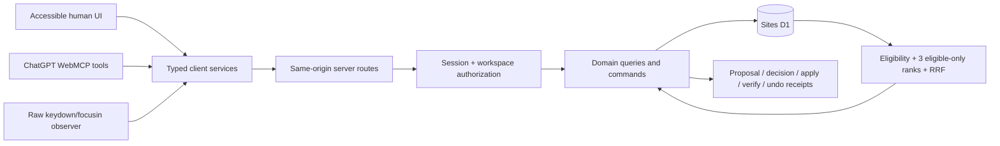

# Focus Contract Studio — Technical Specification

Status: **BUILD AUTHORITY**

## Overview

Build one full-stack ChatGPT Site whose visible UI and four page-bound WebMCP tools share the same typed query/command layer. Persist authoritative state in Sites-managed D1. Keep the browser responsible only for rendering, raw event capture, and calling server commands. Keep ChatGPT responsible for reasoning. Keep review authority in an exact UI-mediated decision bound to the proposal digest and base revision.

## Top-one stack

| Layer | Selected implementation |
|---|---|
| Project foundation | Current official ChatGPT Sites creation workflow with D1 and optional auth capability; the exact generator command/options/version are discovered, recorded, and then lockfile-pinned by Package 0. |
| Runtime | Generated ChatGPT Sites Worker-compatible server and UI framework; do not replace it with a separately chosen framework. |
| Language | Strict TypeScript; no production JavaScript files. |
| UI | Generated React surface when present, semantic HTML, native `<dialog>`, CSS variables and CSS Modules/global CSS; no UI framework or Storybook. |
| Persistence | Sites D1 binding `DB`; numbered reviewed SQL migrations using the generated mechanism; explicit ordered prepared D1 statements and guarded `batch()` calls for runtime commands. Use Drizzle only if the generated scaffold already supports it and the probe passes. |
| Contracts | Zod 4 strict schemas; `z.toJSONSchema(..., { target: "draft-07" })` supplies WebMCP input schemas. |
| WebMCP | Native top-level imperative `document.modelContext.registerTool`; feature detection and one abortable singleton registry; no polyfill by default. |
| Retrieval | One indexed D1 eligibility query capped at 36 rows; deterministic eligible-only TypeScript BM25 + structured applicability + subject-edge rank; clean-room TypeScript RRF with `k=60`. |
| Crypto | Native Web Crypto: `crypto.randomUUID`, SHA-256 canonical proposal hash, HMAC-SHA-256 identity/session derivation, and the domain-separated five-minute evidence token. |
| Unit/component tests | Generated-compatible Vitest 4.1+, Testing Library, and Istanbul coverage. |
| Worker/D1 tests | Current Cloudflare Vitest plugin if compatible with the generated Site; otherwise the generated official Sites D1 harness must be used and documented before feature work. |
| Browser tests | Playwright plus `@axe-core/playwright`; WebMCP API shim for automation, real ChatGPT acceptance, and conditional Chrome acceptance only after the current hosted probe passes. |
| Hosting | ChatGPT Sites only, with D1; freeze source commit `C`, save a Sites version built from `C`, then deploy and attest the exact mapping. Every deployment URL is production; a saved version is not a storage-isolated preview. |

Primary references: [ChatGPT Sites](https://learn.chatgpt.com/docs/sites), [OpenAI Site tools](https://learn.chatgpt.com/docs/webmcp), [WebMCP specification](https://webmachinelearning.github.io/webmcp/), [Cloudflare D1](https://developers.cloudflare.com/d1/), [Zod JSON Schema](https://zod.dev/json-schema), [Playwright accessibility testing](https://playwright.dev/docs/accessibility-testing).

## Architecture



Detailed authority: `docs/architecture/ARCHITECTURE.md`.

## File structure

The bootstrap probe must map these logical modules onto the generated starter. Generated route/build/config paths outrank this illustrative layout:

```text
focus-contract-studio/
├── <generated UI/route root>/     # metadata, page, components, same-origin routes
├── src/
│   ├── contracts/                 # Zod, JSON Schema, error envelopes
│   ├── domain/                    # pure state machine and invariants
│   ├── db/                        # D1 helper, schema declaration, repositories
│   ├── retrieval/                 # ranks, RRF, explanations, abstention
│   ├── security/                  # session, CSRF, identity, hashing, limits
│   ├── verification/              # event grammar and behavior evaluator
│   └── webmcp/                    # singleton registry and four adapters
├── <generated migrations path>/  # numbered and inspected SQL migrations
├── tests/
│   ├── unit/
│   ├── d1/
│   ├── component/
│   ├── e2e/
│   ├── webmcp/
│   └── retrieval/
├── fixtures/rrf/                  # sealed v2 base/overrides, 12 dev + 18 procedural holdout cases
├── docs/                          # copied build authority and evidence
├── scripts/                       # seed, benchmark, evidence report only
├── .openai/hosting.json           # generated/verified project_id, d1=DB, r2=null
├── LICENSE                        # Apache-2.0
├── README.md
└── <generated lockfile>           # exact dependency graph
```

## Data flow

### Read and propose

1. Server resolves an anonymous session or signed-in subject to one workspace.
2. Page loads exact active variant/revision/contract and registers WebMCP once.
3. Raw observer captures the current rehearsal session.
4. `read_active_focus_review` calls the server query with no caller-selected workspace/variant.
5. Server prefilters eligible precedent, builds three ranked lists, fuses them, and returns a bounded evidence packet plus a session/workspace/state/result-bound five-minute HMAC token. This read creates no product-state row.
6. ChatGPT sends the token, displayed citations, strict focus configuration, base revision, summary, and idempotency key through `create_focus_contract_proposal`.
7. Server resolves current state, reruns the frozen retrieval as of the token issue second, reconstructs and verifies the token/results/citations, then validates, canonicalizes, hashes, and checks changed-field support.
8. One guarded D1 batch stores the accepted retrieval snapshot, field-support links, and immutable proposal without changing the active implemented revision. A stale, expired, tampered, cross-session, cross-workspace, or result-mismatched token creates nothing.

### Review and apply

1. The reviewer edits by creating a child proposal or reviews the exact existing proposal in the visible UI.
2. UI-mediated approval stores proposal ID, hash, base revision, reviewer subject, and time.
3. Apply receives proposal ID, expected revision, and idempotency key only.
4. Server re-reads authoritative proposal/approval/workspace state and executes one guarded D1 batch in which every write repeats the application guard; a finalizer trigger aborts the transaction unless all expected state changes occurred.
5. The implementation inspects every D1 result's `meta.changes`; unique constraints, conditional writes, and the finalizer permit one new revision and one receipt. A zero-row conditional write is failure, not success.
6. Same-key retry returns the original receipt; stale/invalid state fails with zero mutation.

### Verify and undo

1. User reopens the applied dialog and completes the bounded keyboard rehearsal.
2. Raw events are finalized under the exact revision/session.
3. Verifier evaluates events independently and stores a receipt.
4. Undo uses the same protected command layer to create a new revision containing the prior contract.

## Components and responsibilities

### Workspace bootstrap

Implements: `prd.md > Epic 1`

- Anonymous secure cookie, optional Sites sign-in only after hosted probes, exact validated email-byte HMAC subject derivation, D1 seed/reset, TTL, and limits.
- Never chooses another user's workspace from client input.

### Focus playground

Implements: `prd.md > Epic 2`

- Renders native modal dialog from current revision.
- Captures bounded raw events; never generates a passing trace from the contract.

### Decision memory

Implements: `prd.md > Epic 3`

- Prefilter, three ranks, RRF, explanations, conflicts, and abstention.
- Pure reads return evidence plus a short non-authorizing token and create no rows. Only successful proposal creation persists the accepted evidence snapshot; retrieval has no dependency edge into approval creation.

### Proposal and review

Implements: `prd.md > Epic 4`

- Immutable proposal versions, canonical hash, field diff, review decisions, rationale, revocation, and supersession.

### Application command

Implements: `prd.md > Epic 5`

- Execution-time authorization, hash/revision checks, idempotency, atomic revision and receipt.

### Independent verifier and history

Implements: `prd.md > Epic 6`

- Raw-event evaluator, receipt, planted divergence test, revision history, undo.

### WebMCP registry

Implements: `prd.md > Epic 7`

- Four adapters only; generated JSON schemas; bounded results; accurate annotations; singleton lifecycle.

### Judge and submission evidence

Implements: `prd.md > Epic 8`

- Deterministic demo reset, evidence export, client matrix, release identity, 170-second proof.

## API surface

All endpoints are same-origin JSON, require session/workspace authorization, reject unknown fields, enforce body/field limits, validate Origin/CSRF on writes, and return the common error envelope.

| Route | Method | Purpose |
|---|---|---|
| `/api/session` | GET/POST | Resolve or create current workspace and CSRF token. |
| `/api/demo/reset` | POST | Reset only current demo workspace under rate and state guards. |
| `/api/review/active` | GET | Exact active review plus bounded RRF packet. |
| `/api/proposals` | POST | Create immutable proposal or child proposal. |
| `/api/proposals/:id/decision` | POST | UI-mediated approve/reject/revoke; not a WebMCP tool. |
| `/api/proposals/:id/apply` | POST | Apply exact approved proposal atomically. |
| `/api/rehearsals` | POST/PATCH | Start and finalize bounded raw observation session. |
| `/api/verifications` | POST | Evaluate finalized session and write receipt. |
| `/api/revisions/:revision/undo` | POST | Create restoration revision. |
| `/api/history` | GET | Bounded current-workspace history. |

Exact fields and errors live in `docs/architecture/DOMAIN_MODEL.md` and `docs/contracts/WEBMCP_TOOL_CONTRACT.md`.

## AI usage

- ChatGPT reads live state and precedent through WebMCP, reasons, and sends a structured proposal.
- The app does not call OpenAI or another model API.
- Deterministic application code validates, stores, authorizes, applies, verifies, and undoes.
- RRF ranks precedent; it is not AI reasoning, truth, confidence, or approval.

## Risks and mandatory probes

Before product feature work, prove:

- generated Sites framework, build scripts, Worker entry, D1 migration flow, and package versions;
- local and hosted D1 binding behavior;
- HttpOnly/secure cookie behavior on the hosted Site;
- exact documented Sites authenticated-email header, anti-spoofing behavior, and repeat-sign-in byte stability; omit optional sign-in if either hosted probe fails;
- `document.modelContext`, registration signal, cancellation signal, and annotations in ChatGPT;
- current Chrome WebMCP flag/API surface only as a conditional client claim;
- public signed-out access and Sites quota sufficient through judging;
- Cloudflare Vitest plugin compatibility with the generated Site.

Probe failure is recorded as FAIL with evidence. It is never hidden behind an untested compatibility shim.

## Demo and submission flow

Use `docs/delivery/SUBMISSION_PLAN.md`. The first 15 seconds must show revision 1 rendering Delete, precedent D001 saying Cancel, and `DECISION MISMATCH`; the proposal follows immediately and remains visibly `NOT APPLIED`. The final package must freeze source commit `C`, the Sites version built from `C`, the deployed URL, video, evidence, and Devpost copy through a separate immutable release attestation.
